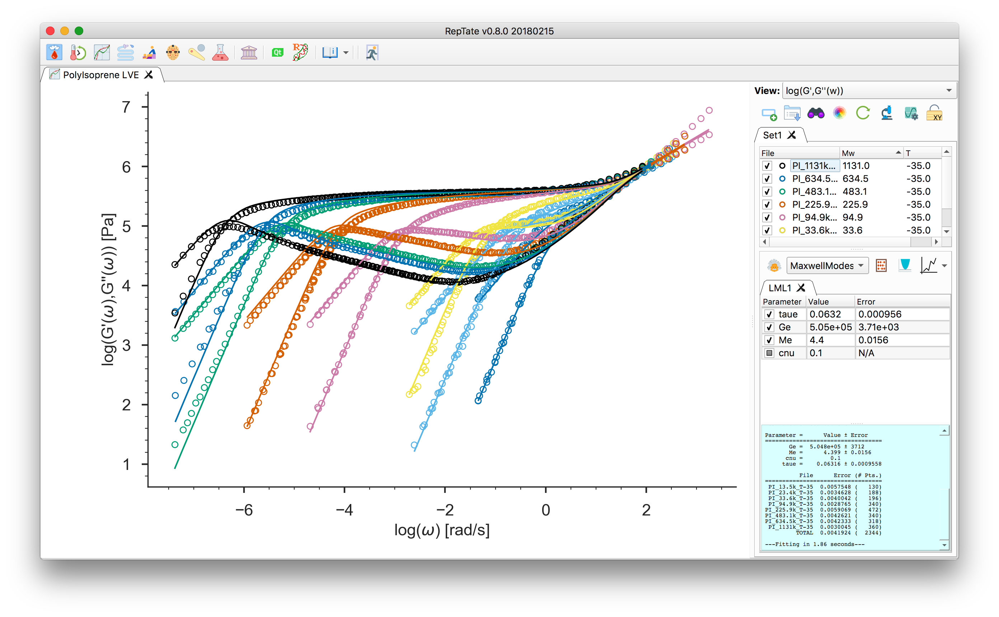
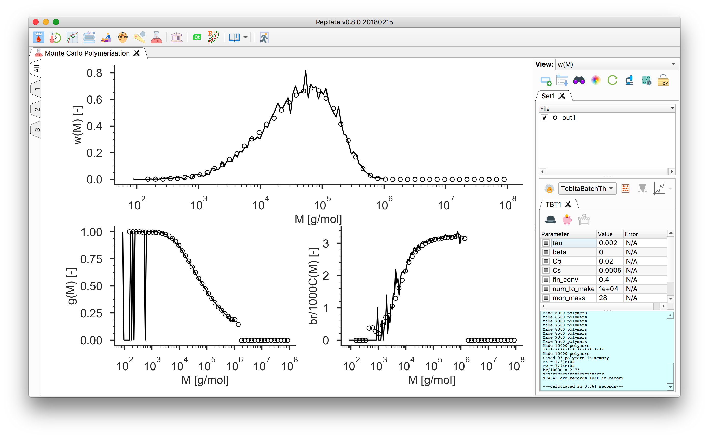

==========================================================================================
RepTate: Rheology of Entangled Polymers: Toolkit for the Analysis of Theory and Experiment
==========================================================================================

New implementation of RepTate in python:
- Dual user interface: 
    - Graphical User Interface (GUI), using pyqt.
    - Command Line Interface (CL) for batch processing
- Works on Windows, Linux and Mac.

More info: 

- Documentation at ReadTheDocs_.

.. _ReadTheDocs: http://reptate.readthedocs.io/en/latest/index.html

- Download a binary installation package from Jorge Ramirez's blog at UPM_.

.. _UPM: http://blogs.upm.es/compsoftmatter/software/reptate

