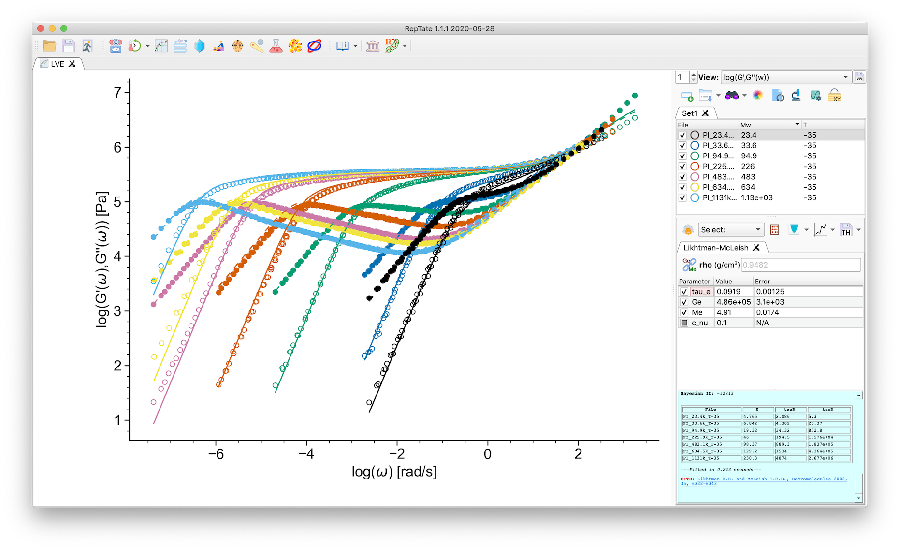
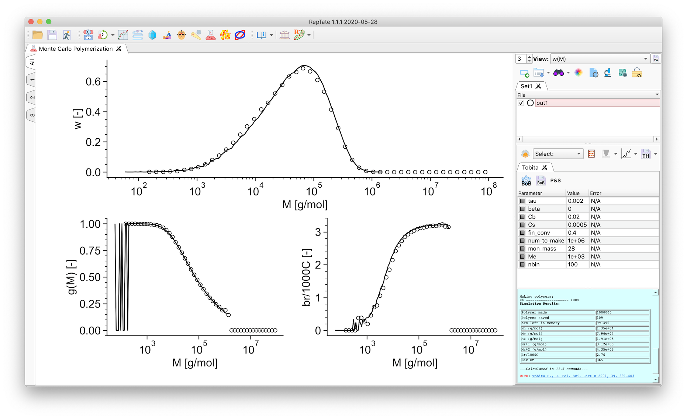

==========================================================================================
RepTate: Rheology of Entangled Polymers: Toolkit for the Analysis of Theory and Experiment
==========================================================================================

RepTate Rheology Software
-------------------------

- Dual user interface: 
    - Graphical User Interface (GUI), using PySide6
    - Command Line Interface (CL) for batch processing   
- Works on Windows, Linux and Mac
- Free and open source
- License GPLv3+

More Info
----------

- Documentation: `http://reptate.readthedocs.io/ <http://reptate.readthedocs.io/>`_

- The installation instructions: `https://reptate.readthedocs.io/installation.html <https://reptate.readthedocs.io/installation.html>`_.

Cite RepTate
------------

Boudara V.A.H, Daniel J. Read and Jorge Ramírez, "RepTate rheology software: Toolkit for the analysis of theories and experiments", Journal of Rheology 64, 709 (2020); `https://doi.org/10.1122/8.0000002 <https://doi.org/10.1122/8.0000002>`_

