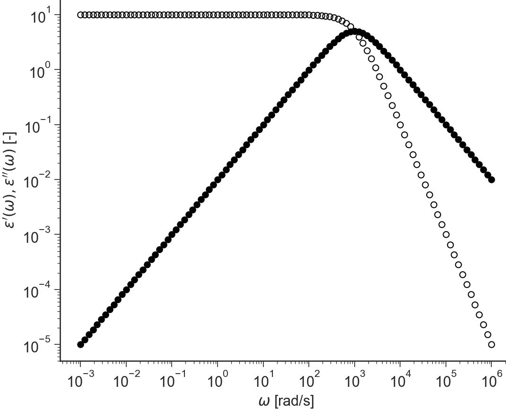
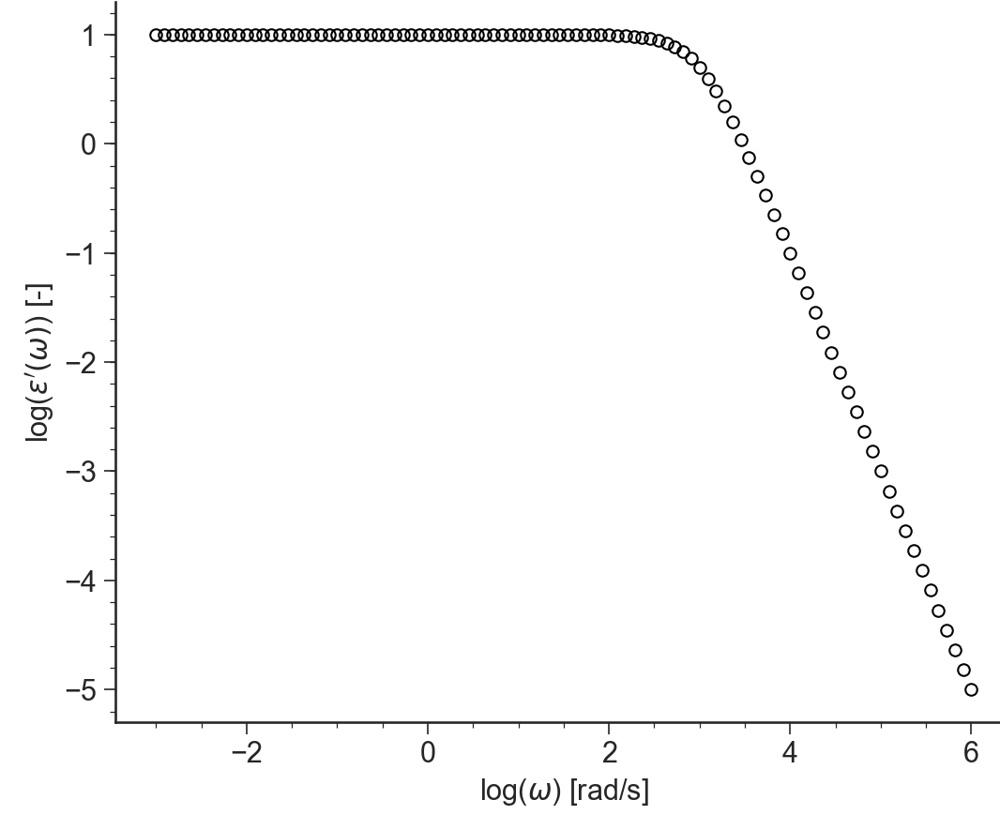

==================================
Dielectric: General Description
==================================

.. contents:: Contents
    :local:

..	toctree::
   	:maxdepth: 2

-------
Purpose
-------

.. autoclass:: ApplicationDielectric.ApplicationDielectric()	
	
----------
Data Files
----------

.. include:: ../datafile_doc.rst

``.tts`` extension
-------------------

.. warning::
    NEEDS TO BE DONE

Text files with ``.dls`` extension should be organised as follows:

- ``.dls`` files should **at least** the value parameter values for the:

  #. sample molar mass ``Mw``,
  #. temperature ``T``.

- 3 columns separated by **spaces** or **tabs** containing respectively:

  #. frequency, :math:`\omega`,
  #. elastic modulus, :math:`G'`,
  #. loss modulus :math:`G''`.

Other columns will be ignored. A correct ``.tts`` file looks like:

.. code-block:: none
  
  T=-35;CTg=14.65;dx12=0;isof=true;Mw=13.5;chem=PI;PDI=1.04;
  1.90165521264016E+0000      7.38023647054321E+0001      1.35152457625702E+0004     -2.99910000000000E+0001
  3.01392554124040E+0000      1.99063258930248E+0002      2.14834778959042E+0004     -2.99900000000000E+0001
  4.51700049635957E+0000      3.72861375546198E+0002      3.17756716623334E+0004     -3.99960000000000E+0001
  ...                         ...                         ...                        ...

-----
Views
-----

log(e',e''(w))
--------------------------------

.. automethod:: ApplicationDielectric.BaseApplicationDielectric.viewLogE1E2()

.. image:: images/Dielectric_LogE1E1.png
    :width: 45%
    :align: center

semilog(e',e''(w))
-------------------------------------------

.. automethod:: ApplicationDielectric.BaseApplicationDielectric.viewSemiLogE1E2()

.. image:: images/Dielectric_SemiLogE1E1.png
    :width: 45%
    :align: center

e'(w)", "e''(w)    
----------------------

.. automethod:: ApplicationDielectric.BaseApplicationDielectric.viewE1E2()

log(e')    
----------------------------

.. automethod:: ApplicationDielectric.BaseApplicationDielectric.viewLogE1()

semilog(e')
----------------------

.. automethod:: ApplicationDielectric.BaseApplicationDielectric.viewSemiLogE1()

.. image:: images/Dielectric_SemiLogE1.png
    :width: 45%
    :align: center

e'
----------------------------

.. automethod:: ApplicationDielectric.BaseApplicationDielectric.viewE1()

.. image:: images/Dielectric_E1.png
    :width: 45%
    :align: center

log(e'')    
----------------------------

.. automethod:: ApplicationDielectric.BaseApplicationDielectric.viewLogE2()

.. image:: images/Dielectric_LogE2.png
    :width: 45%
    :align: center

semilog(e'')
----------------------

.. automethod:: ApplicationDielectric.BaseApplicationDielectric.viewSemiLogE2()

.. image:: images/Dielectric_SemiLogE2.png
    :width: 45%
    :align: center

e''
----------------------------

.. automethod:: ApplicationDielectric.BaseApplicationDielectric.viewE2()

.. image:: images/Dielectric_E2.png
    :width: 45%
    :align: center

Cole-Cole
----------------------------

.. automethod:: ApplicationDielectric.BaseApplicationDielectric.viewColeCole()

.. image:: images/Dielectric_ColeCole.png
    :width: 45%
    :align: center
