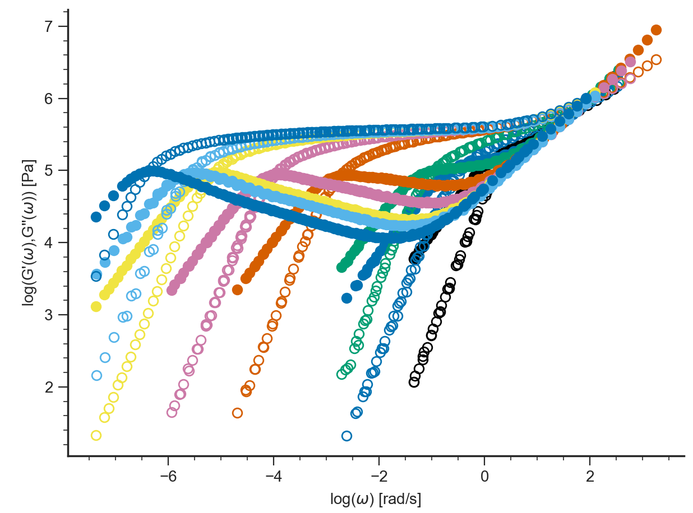
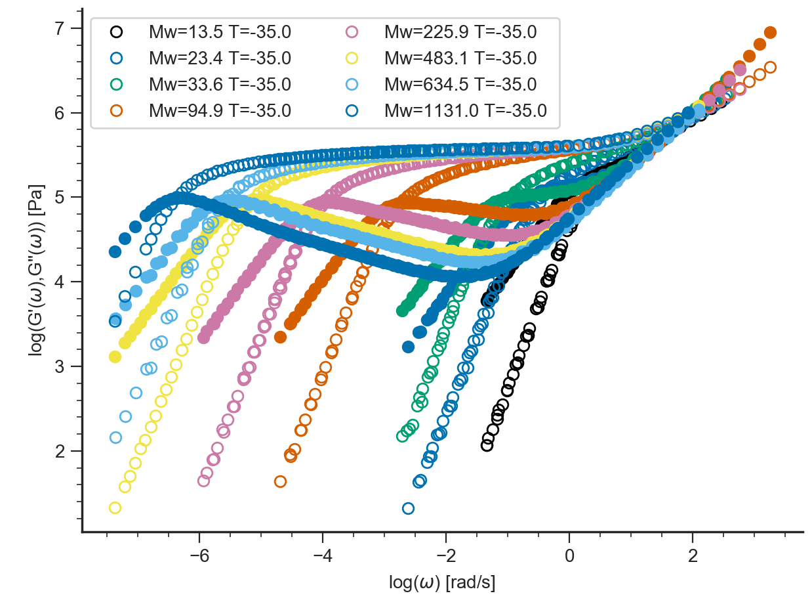
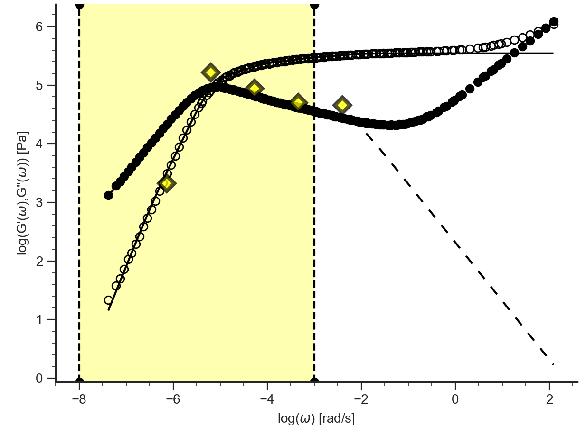

=====================================
Tutorial LVE Application Command Line
=====================================

.. toctree::
   :maxdepth: 2

.. hint::
	.. include:: /manual/Applications/All_Tutorials/tutorialCL_instructions.rst

Likhtman-McLeish theory
-----------------------

Prediction of LVE data of linear polymer melts

#. Start Reptate and create LVE Application::

    > RepTate.py
    Reptate Version 0.5 command processor
    help [command] for instructions
    TAB for completions
    reptate> new LVE
    reptate/LVE1/DataSet01>

#. Add files to the dataset (master curve tts files)::

    open data/PI_LINEAR/PI_13.5k_T-35.tts
    open data/PI_LINEAR/PI_23.4k_T-35.tts
    open data/PI_LINEAR/PI_33.6k_T-35.tts
    open data/PI_LINEAR/PI_94.9k_T-35.tts
    open data/PI_LINEAR/PI_225.9k_T-35.tts
    open data/PI_LINEAR/PI_483.1k_T-35.tts
    open data/PI_LINEAR/PI_634.5k_T-35.tts
    open data/PI_LINEAR/PI_1131k_T-35.tts
    
#. Plot the files using the default LVE Application view::

    plot

#. View the legend. By default, the legend shows the most important file parameters, according to the corresponding file type.

    legend

#. Create new theory (calculation is done with default parameter values)::
    
    theory_new Likhtman-McLeish
    WARNING: Mw of PI_13.5k_T-35 is too small

            File      Error (# Pts.)
    ==================================
    PI_13.5k_T-35     24.004 (   130)
    PI_23.4k_T-35     24.142 (   188)
    PI_33.6k_T-35     22.957 (   196)
    PI_94.9k_T-35     14.238 (   340)
    PI_225.9k_T-35     12.748 (   472)
    PI_483.1k_T-35     10.176 (   340)
    PI_634.5k_T-35      9.179 (   318)
    PI_1131k_T-35     7.8555 (   360)
            TOTAL     13.747 (  2344)

    ---Calculated in 0.0695 seconds---

#. Fit the theory to the data files ()::

    fit
    OptimizeWarning: Covariance of the parameters could not be estimated category=OptimizeWarning)
    Solution found with 85 function evaluations and error 0.00415354
        Parameter        Value +/-      Error (if it was optimized)
        =============================================
             Ge = 4.8317e+05 +/-        inf
             Me =          5 +/-        inf
            cnu =        0.1
           taue =     0.1029 +/-        inf
                            File      Error (  # Points)
          =============================================
    data/PI_LINEAR/PI_13.5k_T-35  0.0066726 (       130)
    data/PI_LINEAR/PI_23.4k_T-35  0.0092436 (       188)
    data/PI_LINEAR/PI_33.6k_T-35  0.0027997 (       196)
    data/PI_LINEAR/PI_94.9k_T-35  0.0029624 (       340)
    data/PI_LINEAR/PI_225.9k_T-35 0.0070505 (       472)
    data/PI_LINEAR/PI_483.1k_T-35 0.0026445 (       340)
    data/PI_LINEAR/PI_634.5k_T-35  0.002892 (       318)
    data/PI_LINEAR/PI_1131k_T-35  0.0011891 (       360)
                           TOTAL  0.0041535 (      2344)    

#. Save theory predictions. Files with extension `_th.tts` are saved in the same folder where the experimental data was found.::
    
    save
    Saving prediction of Likhtman-McLeish theory
    File: data/PI_LINEAR/PI_13.5k_T-35
    File: data/PI_LINEAR/PI_23.4k_T-35
    File: data/PI_LINEAR/PI_33.6k_T-35
    File: data/PI_LINEAR/PI_94.9k_T-35
    File: data/PI_LINEAR/PI_225.9k_T-35
    File: data/PI_LINEAR/PI_483.1k_T-35
    File: data/PI_LINEAR/PI_634.5k_T-35
    File: data/PI_LINEAR/PI_1131k_T-35
    
#. Exit Reptate (the y answer is needed)::
    
    quit
    
Fit Maxwell modes to LVE
------------------------

#. Create LVE Application::

    new LVE

#. Add files to the dataset (master curve tts files)::
    
    open data/PI_LINEAR/PI_483.1k_T-35.tts

#. Plot the files using the default LVE Application view::

    plot
    
#. Create new theory::

    theory_new MaxwellModesFrequency
    
#. Set the xrange for the fitting (wrt the current view)::

    xrange -8 -3
    
#. Change the number of Maxwell modes::

    nmodes=5
    
#. Fit the theory to the data files::

    fit
    ==================================
    PARAMETER FITTING
    ==================================
    xrange=[-8, -3]
    Initial Error = 452.652 -->
    Final Error   = 0.0968955
    348 function evaluations

    Parameter =      Value ± Error
    ==================================
    logG00 =      3.321 ± 0.1096
    logG01 =      5.214 ± 0.01502
    logG02 =      4.939 ± 0.02825
    logG03 =      4.701 ± 0.05453
    logG04 =      4.655 ± 0.1784
    logG05 =      104.6 ± 1.201e-16
    logG06 =     -62.01 ± 0
    logG07 =      5.698 ± 0
    logG08 =      6.041 ± 0
    logwmax =     -2.405 ± 0.1423
    logwmin =     -6.136 ± 0.04879
    nmodes =          5

            File      Error (# Pts.)
    ==================================
    PI_483.1k_T-35 0.00055687 (   174)
            TOTAL 0.00055687 (   174)

    ---Fitting in 0.216 seconds---

    
#. Save theory predictions::

    save
    
#. Exit Reptate (the y answer is needed)::

    quit
