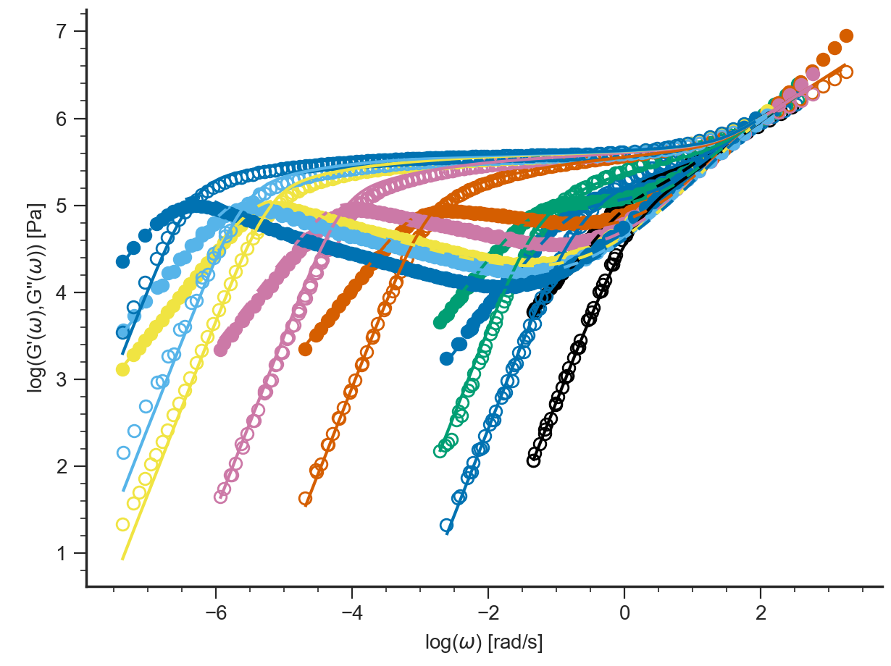

=====================================
LVE Tutorial: Command Line
=====================================

.. contents:: Contents
    :local:

.. toctree::
   :maxdepth: 2

.. hint::
	.. include:: /manual/Applications/All_Tutorials/tutorialCL_instructions.rst

-----------------------
Likhtman-McLeish theory
-----------------------

Prediction of LVE data of linear polymer melts

#. Start Reptate and create LVE Application::

    > RepTate.py
    Reptate Version 0.5 command processor
    help [command] for instructions
    TAB for completions
    reptate> new LVE
    reptate/LVE1/DataSet01>

#. Add files to the dataset (master curve tts files)::

    open data/PI_LINEAR/PI_13.5k_T-35.tts
    open data/PI_LINEAR/PI_23.4k_T-35.tts
    open data/PI_LINEAR/PI_33.6k_T-35.tts
    open data/PI_LINEAR/PI_94.9k_T-35.tts
    open data/PI_LINEAR/PI_225.9k_T-35.tts
    open data/PI_LINEAR/PI_483.1k_T-35.tts
    open data/PI_LINEAR/PI_634.5k_T-35.tts
    open data/PI_LINEAR/PI_1131k_T-35.tts
    
#. Plot the files using the default LVE Application view::

    plot
.. image:: images/PI_LVE_plot.png
    :width: 70%
    :align: center
    :alt: Empty Graph window

#. View the legend. By default, the legend shows the most important file parameters, according to the corresponding file type::

    legend
.. image:: images/PI_LVE_legend.png
    :width: 70%
    :align: center
    :alt: PI_LVE_legend

#. Create new theory (calculation is done with default parameter values). Type::
    
    theory_new Likhtman-McLeish

   The output is::

    CITE: Likhtman A.E. and McLeish T.C.B., Macromolecules 2002, 35, 6332-6343
    File               Error (RSS)        # Pts
    PI_13.5k_T-35      24                 130
    PI_23.4k_T-35      23.84              188
    PI_33.6k_T-35      22.61              196
    PI_94.9k_T-35      14.12              340
    PI_225.9k_T-35     12.85              472
    PI_483.1k_T-35     10.16              340
    PI_634.5k_T-35     9.154              318
    PI_1131k_T-35      7.868              360

    TOTAL ERROR:       13.695 (2344 Pts)
    Bayesian IC:       6157.5

    ---Calculated in 0.*** seconds---

    CITE: Likhtman A.E. and McLeish T.C.B., Macromolecules 2002, 35, 6332-6343

#. Fit the theory to the data files. Type::

    fit

   The output is::

    Parameter Fitting
    Initial Error      Final Error
    32100              9.82695

    109 function evaluations
    Parameter          Value ± Error
    Ge                 5.048e+05 ± 3712
    Me                 4.399 ± 0.0156
    cnu                0.1
    taue               0.06316 ± 0.0009558

    File               Error (RSS)        # Pts
    PI_13.5k_T-35      0.005755           130
    PI_23.4k_T-35      0.003463           188
    PI_33.6k_T-35      0.004004           196
    PI_94.9k_T-35      0.002877           340
    PI_225.9k_T-35     0.005907           472
    PI_483.1k_T-35     0.004262           340
    PI_634.5k_T-35     0.004233           318
    PI_1131k_T-35      0.003005           360

    TOTAL ERROR:    0.0041924 (2344 Pts)
    Bayesian IC:       -12809

    ---Fitted in 0.*** seconds---

    CITE: Likhtman A.E. and McLeish T.C.B., Macromolecules 2002, 35, 6332-6343

#. Save theory predictions. Files with extension ``_TH.tts`` are saved in the same folder as the experimental data.
   Type::
    
    save

   The output is::

    Saving prediction of Likhtman-McLeish theory

#. Exit Reptate (the y answer is needed). Type::
    
    quit

------------------------
Fit Maxwell modes to LVE
------------------------

#. Create LVE Application::

    new LVE

#. Add files to the dataset (master curve tts files)::
    
    open data/PI_LINEAR/PI_483.1k_T-35.tts

#. Plot the files using the default LVE Application view::

    plot
    
#. Create new theory::

    theory_new Maxwell Modes

   The output is::

    File               Error (RSS)        # Pts
    PI_483.1k_T-35     0.2345             340

    TOTAL ERROR:      0.23451 (340 Pts)
    Bayesian IC:      -428.98

    ---Calculated in 0.*** seconds---

.. image:: images/Maxwell_freq.png
    :width: 70%
    :align: center
    :alt: Graph window
    
#. If needed, change the xrange for the fitting (with respect to the current view)::

    xrange -8 -3
    
#. Change the number of Maxwell modes::

    nmodes=5
    
#. Fit the theory to the data files, type::

    fit

   The output is::

    Parameter Fitting
    xrange=[-8, -3]
    Initial Error      Final Error
    22.4319            0.0968955

    199 function evaluations
    Parameter          Value ± Error
    logG00             3.321 ± 0.1082
    logG01             5.214 ± 0.01484
    logG02             4.939 ± 0.02791
    logG03             4.701 ± 0.05387
    logG04             4.655 ± 0.1762
    logwmax            -2.405 ± 0.1406
    logwmin            -6.136 ± 0.04819
    nmodes             5

    File               Error (RSS)        # Pts
    PI_483.1k_T-35     0.0005569          174

    TOTAL ERROR:   0.00055687 (174 Pts)
    Bayesian IC:      -1267.7

    ---Fitted in 0.*** seconds---

.. image:: images/Maxwell_freq_final.png
    :width: 70%
    :align: center
    :alt: Graph window
    
#. Save theory predictions::

    save
    
#. Exit Reptate (the y answer is needed)::

    quit
