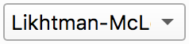

======================================
LVE Tutorial: Graphical User Interface
======================================

.. contents:: Contents
    :local:

.. toctree::
   :maxdepth: 2

.. |logo| image:: /app_logo/LVE.png
    :width: 20pt
    :height: 20pt
    :align: bottom

.. |einstein| image:: /gui_icons/icons8-einstein.png
    :width: 20pt
    :height: 20pt
    :align: bottom

.. |fit| image:: /gui_icons/icons8-minimum-value.png
    :width: 20pt
    :height: 20pt
    :align: bottom

.. |th_save| image:: /gui_icons/icons8-save_TH.png
    :width: 20pt
    :height: 20pt
    :align: bottom

#.  Start RepTate and create a new LVE Application |logo|:
    
    .. image:: images/open_LVE_app.png
        :width: 75%
        :align: center
        :alt: New application

#.  Drag and drop a file(s) with a ``.tts`` extension, e.g. the set of ``PI_**k_T-35.tts`` files in the ``data/PI_LINEAR/`` 
    folder, with molecular weight from "13.5k" to "1131k".
    See :ref:`LVE: General Description` for a description of the data file organization.
   
    .. image:: images/open_files.png
        :width: 75%
        :align: center
        :alt: Load data

#.  Select a theory, e.g. "Likthman-McLeish" |theory|, and press |einstein| to create it (calculation is done with default parameter values).
    Press "Minimize Error" |fit|.
    
    .. image:: images/new_theory.png
        :width: 75%
        :align: center
        :alt: New theory

#.  To save the theory line(s), click the |th_save| button.