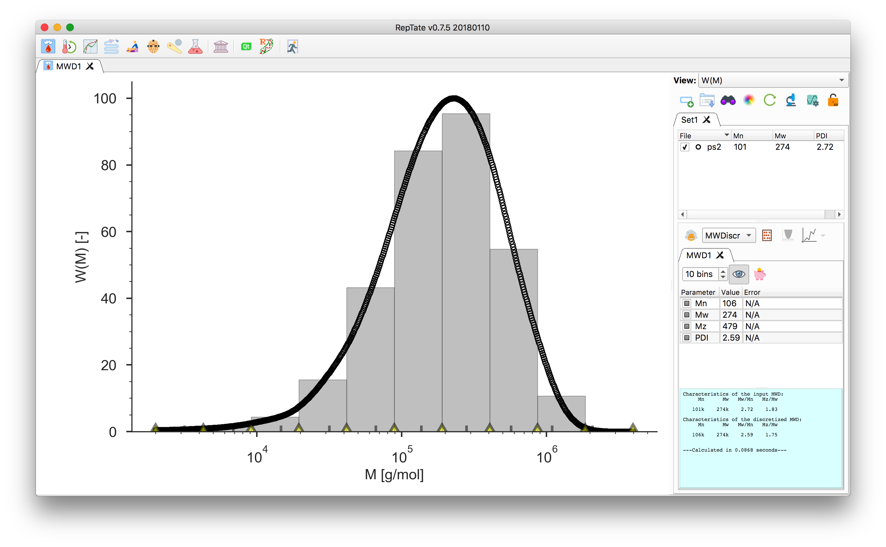

------------------
MWD Discretization
------------------

.. |th_save| image:: /gui_icons/icons8-save_TH.png
    :width: 20pt
    :height: 20pt
    :align: bottom
    
	
.. |fileparam| image:: ../Tutorial/images/file_parameters.png
    :height: 20pt
    :align: bottom

.. |thparam| image:: ../Tutorial/images/th_parameters.png
    :width: 45pt
    :align: bottom

- The area, :math:`\phi_i`, of each grey bin corresponds to the area under the data curve delimited by the bin edges.
  The height, :math:`h_i`, of the bin is the area divided by the bin width (on a :math:`\log_{10}` scale).

  You can change the number of bins and move the bin edges by dragging the yellow markers.

- In the bottom of the plot, the grey tick marks indicate the bin molecular weight
  taken as the weight-average molecular mass value across the bin width

  .. math::
      M_{w,i} = \frac{\sum w_j M_j}{\sum w_j}.

#.  To save the discretized molecular weight, click the |th_save| button.

    The output file contains a header with the moments  :math:`M_n`, :math:`M_w` and the PDI, and two columns.
    The first column is the molecular weight :math:`M_{w,i}` as indicated by the grey tick marks, 
    the second column is :math:`\phi_i`, the value of the area of the covered by the bin. 

    The sum of the areas should equal 1:

    .. math::
       \sum \phi_i = 1.
