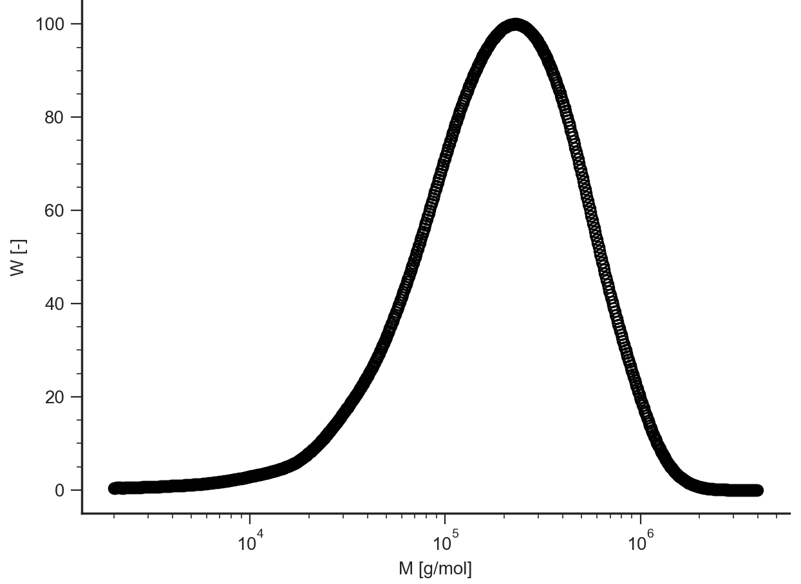
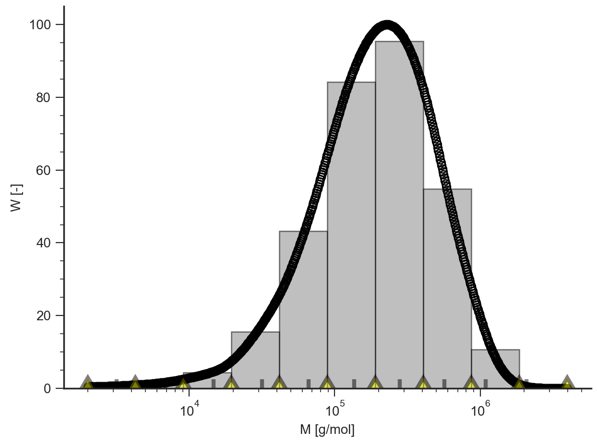
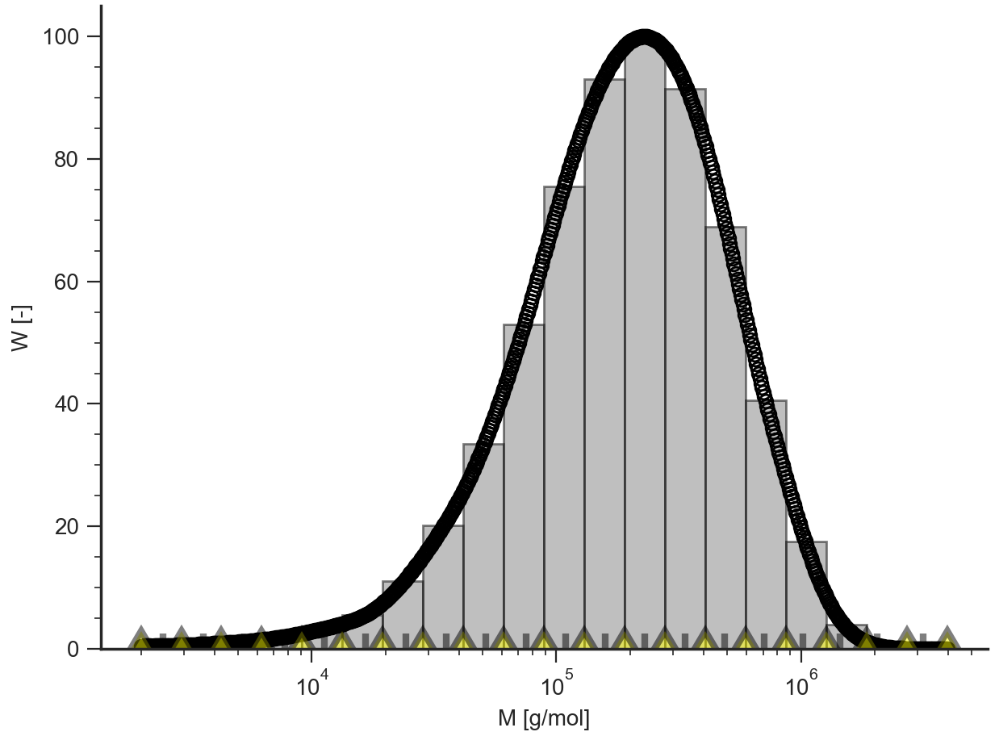

==========================
MWD Tutorial: Command Line
==========================

.. hint::
	.. include:: /manual/Applications/All_Tutorials/tutorialCL_instructions.rst

.. highlight:: none

Start RepTate and open a new MWD application::
	
	RepTate> new MWD

Open a data file containing a GPC data (see :ref:`MWD_Data_Description`) and display the data::

	RepTate/MWD1/DataSet01> open data/PS_Linear_Polydisperse/ps2.gpc
	RepTate/MWD1/DataSet01> plot

Open a new "Discretize MWD" theory::

	RepTate/MWD1/DataSet01> theory_new Discretize MWD

The output is::

	Characteristics of the input MWD
	Mn (kg/mol)  Mw (kg/mol)  Mw/Mn     Mz/Mw     Mz+1/Mz
	101          274          2.72      1.83      1.5

	Characteristics of the discretized MWD
	Mn (kg/mol)  Mw (kg/mol)  Mw/Mn     Mz/Mw     Mz+1/Mz
	106          274          2.59      1.75      1.45

Change the number of bins to 20::

	RepTate/MWD1/DataSet01/Discretize MWD01> nbin=20

The output is::

	Characteristics of the input MWD
	Mn (kg/mol)  Mw (kg/mol)  Mw/Mn     Mz/Mw     Mz+1/Mz
	101          274          2.72      1.83      1.5

	Characteristics of the discretized MWD
	Mn (kg/mol)  Mw (kg/mol)  Mw/Mn     Mz/Mw     Mz+1/Mz
	102          274          2.68      1.8       1.48

#. Save discretized molecular weight::

	RepTate/MWD1/DataSet01/Discretize MWD01> save

#. Exit RepTate (the y answer is needed)::

    RepTate/TTS1/DataSet01/WLF Shift01> quit
