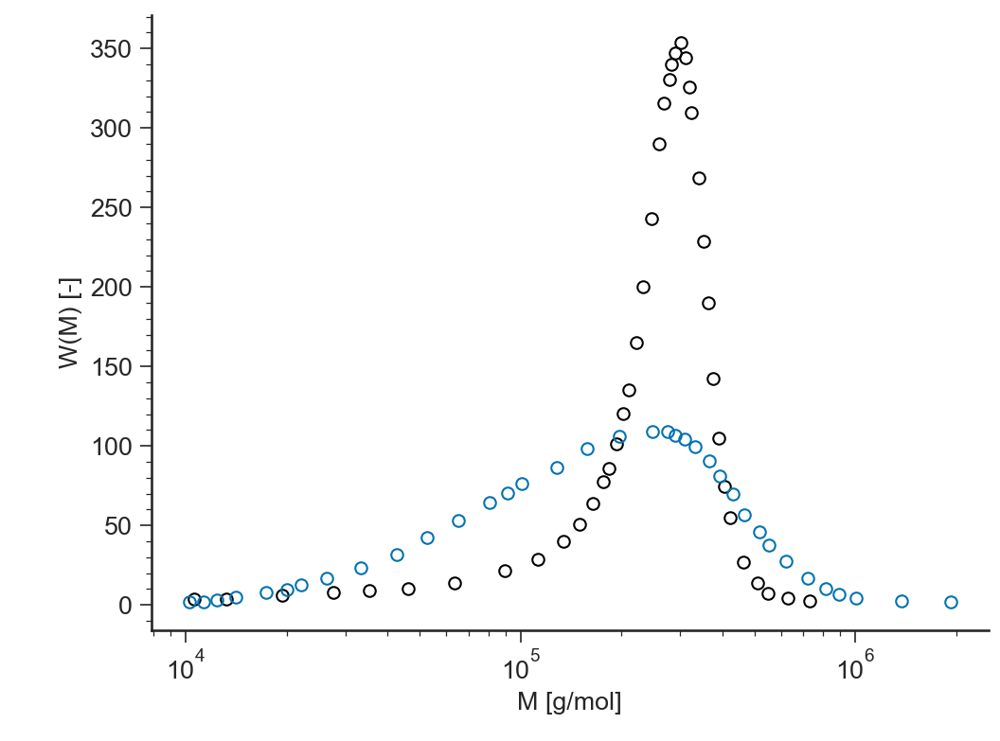
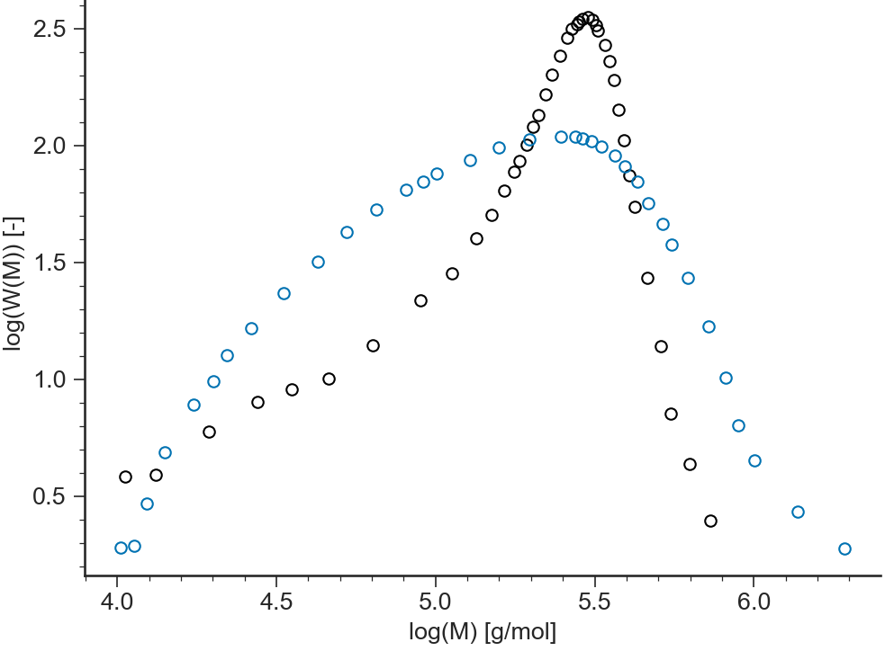
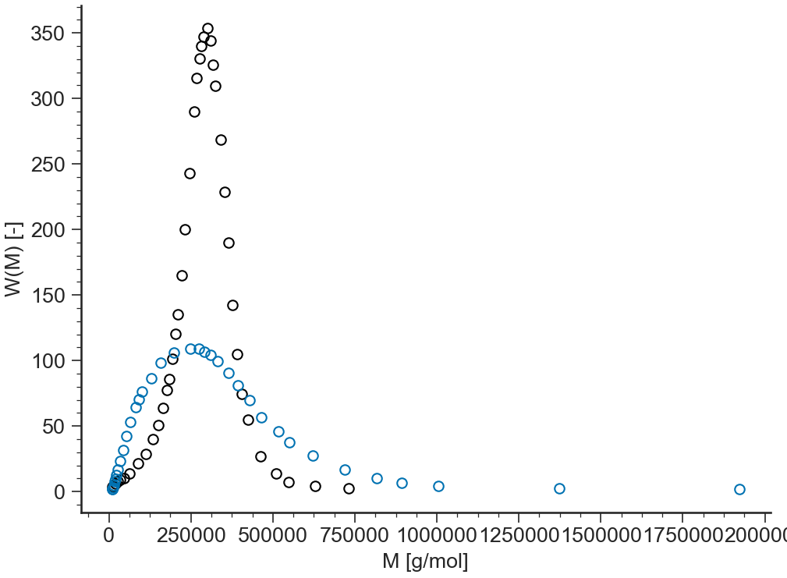

==================================
MWD: General description
==================================

.. contents:: Contents
    :local:

..	toctree::
   	:maxdepth: 2

-------
Purpose
-------

.. autoclass:: ApplicationMWD.ApplicationMWD()	
	
----------
Data Files
----------

.. include:: ../datafile_doc.rst

``.gpc`` extension
-------------------

Text files with ``.gpc`` extension should be organised as follows:

- ``.gpc`` files should provide parameter values for

  #. number-average molar mass, :math:`M_n`
  #. weight-average molar mass, :math:`M_w`
  #. polydispersity index, :math:`\text{PDI}`

- 2 columns separated by **spaces** or **tabs** containing respectively:

  #. molar mass, :math:`M`,
  #. weight associated, :math:`\dfrac{\text d w(\log M)}{\text d \log M}`.

A correct ``.gpc`` file looks like:

.. code-block:: none

  Mn=100;Mw=250;PDI=2.5
  0.1148E+03 0.5000E-03
  0.1514E+03 0.1500E-02
  0.1995E+03 0.1667E-02
  0.2630E+03 0.1750E-02
  0.3467E+03 0.5250E-02
  0.4571E+03 0.6750E-02
  ...        ...       

``.reac`` extension
-------------------

Text files with ``.reac`` extension should be organised as follows:

- ``.reac`` files are not expected
  to provide any specific parameter values.

- 4 columns separated by **spaces** or **tabs** containing respectively:

  #. molar mass, :math:`M`,
  #. weight associated, :math:`\dfrac{\text d w(\log M)}{\text d \log M}`,
  #. the `g`-factor, :math:`g(M)`,
  #. number of branch per 1000 carbon, :math:`\log_{10}(g(M))`.

A correct ``.reac`` file looks like:

.. code-block:: none
  
  0.1148E+03 0.5000E-03 0.1000E+01 0.0000E+00
  0.1514E+03 0.1500E-02 0.1000E+01 0.0000E+00
  0.1995E+03 0.1667E-02 0.1000E+01 0.0000E+00
  0.2630E+03 0.1750E-02 0.1000E+01 0.0000E+00
  0.3467E+03 0.5250E-02 0.1000E+01 0.0000E+00
  0.4571E+03 0.6750E-02 0.9977E+00 0.3765E+00
  ...        ...        ...        ...

-----
Views
-----

log-lin
--------------------------------

:math:`W(M)` vs :math:`M` (in logarithmic scale)

log-log
--------------------------------

:math:`\log(W(M))` vs :math:`\log(M)` 

lin-lin
--------------------------------

:math:`W(M)` vs :math:`M`

