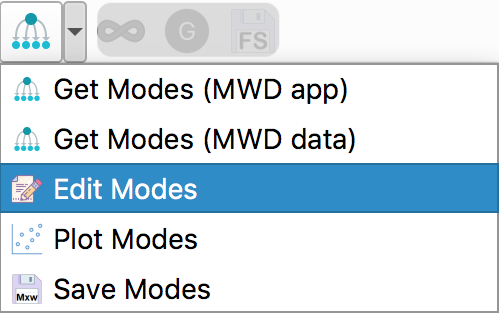

============================
Tutorial Blend of Rolie-Poly
============================

.. |logo| image:: /app_logo/NLVE.png
    :width: 20pt
    :height: 20pt
    :align: bottom

.. |logoLVE| image:: /app_logo/LVE.png
    :width: 20pt
    :height: 20pt
    :align: bottom

.. |einstein| image:: /gui_icons/icons8-einstein.png
    :width: 20pt
    :height: 20pt
    :align: bottom

.. |calculate| image:: /gui_icons/icons8-abacus.png
    :width: 20pt
    :height: 20pt
    :align: bottom

.. |eye| image:: /gui_icons/icons8-visible.png
    :width: 20pt
    :height: 20pt
    :align: bottom

.. |no_fene| image:: /gui_icons/icons8-infinite.png
    :height: 15pt
    :align: bottom

.. |fene| image:: /gui_icons/icons8-facebook-f.png
    :height: 15pt
    :align: bottom

.. |g-correction| image:: /gui_icons/icons8-circled-g-filled.png
    :height: 15pt
    :align: bottom

.. |th_select| image:: images/select_BlendRoliePoly.png
    :height: 15pt
    :align: bottom
	
.. |MWD_from_data| image:: images/select_MWD_from_data.png
    :height: 60pt
    :align: bottom
	

	
**Nonlinear flow prediction**

#.  Start RepTate and create a new NLVE Application |logo|:
    
    .. image:: images/new_NLVE.png
        :width: 400pt
        :align: center
        :alt: New application
		
#.  Drag and drop shear (``.shear``) or uniaxial extension (``.uext``) data files, 
    e.g. all the ``Minegishi_spiked_PS_***.uext`` files from the folder 
    ``data/NLVE_Extension/``. These are the uniaxial extension data for the
    PS686 spiked with 1.5% long chains from :cite:`RPBtut-Minegishi2001`

    The first column of the file should contain the time and the second 
    column the stress (shear, or tensile, stress growth function).

    .. image:: images/load_uext_data_Minegishi.png
        :width: 400pt
        :align: center
        :alt: Load data

#.  Select the "BlendRoliePoly" theory |th_select| and press |einstein| to create it.

    .. image:: images/new_BRP_th.png
        :width: 400pt
        :align: center
        :alt: New theory

    At this point, you need to setup the relaxation times, :math:`\tau_i`, and 
    weights, :math:`g_i`, for each mode :math:`i`.
    You can:

    - Input them manually by clicking "Edit Modes":
      
      .. image:: images/edit_modesBRP.png
          :width: 100pt
          :align: center
          :alt: Edit modes

      then select the number of modes, enter the values and click "OK".
    
    - Obtain an estimate of the linear rheology (i.e. the set of :math:`\tau_{\mathrm{d},i}`)
      from a the molecular weight distribution (MWD). In this case, for each molecular mass mode,
      a reptation time is assigned. For a molecular mass mode :math:`M_i`, the corresponding
      relaxation time is estimated as :math:`\tau_{\mathrm{d},i} = 3 Z_i^3 f_{\mu,i} \tau_\mathrm{e}` 
      where :math:`Z_i = M_i/M_\mathrm{e}`, :math:`M_\mathrm{e}` the entanglement molecualar mass,
      :math:`\tau_\mathrm{e}` the entanglement relaxation time, and :math:`f_{\mu,i}` the contour 
      length fluctuation (CLF) correction.
      
      .. note::
        This works, broadly, within the "dynamic dilution" picture of tube dynamics, which 
        considers that the effective "tube" constraint felt by a given test chain depends 
        on the timescale of the motion being considered. After relaxation of shorter chains, 
        they release their entanglements on longer chains and so, in some sense, act as "solvent"
        for the longer chains. Here, we consider repation along the thin tube, and CLF 
        commensurate with the diluted tube (which speeds up the terminal relaxation because 
        CLF shortens the distance required to reptate).
    
      The stretch relaxation times are calculated as :math:`\tau_{\mathrm{s},i} = Z_i^2 \tau_\mathrm{e}`.

      It is possible to import the MWD form an open MWD application, or by copy-pasting
      MWD data into a table.
      **In this tutorial we will use the latter method.**

#.  To import the MWD form by copy-pasting MWD data, click right arrow of |import_modes| and select 
    "Get Modes (MWD data)"|MWD_from_data|:
	
	.. image:: images/input_MWD_data.png
		:width: 250pt
		:align: center
		:alt: input MWD data
 
#.  Select the number of molecular mass modes and provide the entanglement molecualar weight
    and entanglement relaxation time, respectively :math:`16\,625` g/mol and :math:`3.4 \times 10^{−3}` s
    at 160 :math:`^\circ\mathrm{C}`.
    We use the 21 modes MWD provided in :cite:`RPBtut-Mishler2013` and paste it in the table:

    ============  ============
    :math:`M`     :math:`\phi`
    ============  ============
    11500	        0.00276
    14800	        0.00413
    19200	        0.00649
    24800	        0.009
    32300	        0.0133
    41800	        0.0214
    53900	        0.031
    70400	        0.0452
    90800	        0.0648
    118000        0.0862
    148000	      0.107
    196000	      0.119
    255000	      0.12
    329000	      0.11
    426000	      0.0929
    539000	      0.0691
    696000	      0.0462
    915000	      0.027
    1210000	      0.0138
    1570000	      0.00545
    3200000	      0.0152
    ============  ============

    that we select, copy, and paste in the table:

    .. image:: images/MWD_table_input.png
      :width: 250pt
      :align: center
      :alt: Show LVE

#.  Click "OK" to close the dialog. This launches the calculations of the relaxation times.
    You can look at the result by clicking "Edit Modes" |relax_time|. 

#.  Adjust the parameter ``GN0``. We set it to :math:`2\times 10^5` Pa. Then, press "calculate" |calculate| 
    to get the nonlinear rheology predictions.

    .. image:: images/RPB_pre_result.png
      :width: 400pt
      :align: center
      :alt: Without fene, G 

#.  The calculations can be done using "infinitely stretching chains" |no_fene|
    or with finite extensibility |fene|. In the latter case, the maximum extensibility
    parameter ``lmax`` is present in the parameter table.
    You can change its value and click "calculate" |calculate| to update the theory 
    predictions.
	
#.  Finally, it is possible to correct the modulus (given as the parameter ``GN0``) by clicking 
    |g-correction|. The stress of each species :math:`i` is corrected by a factor :math:`f_{\mu,i}^{1/2}`
    (see Chapter 6 of :cite:`RPBtut-Dealy2018`).
    Note that this option is only available if the relxations times were given via MWD.
    Click "calculate" |calculate| to update the theory predictions:

    .. image:: images/RPB_result.png
      :width: 400pt
      :align: center
      :alt: With fene, G

.. note::
    The minimisation procedure is inactive in this theory.

..todo::
    Cite related publication

.. bibliography:: ../bibliography.bib
    :style: unsrt
    :keyprefix: RPBtut-