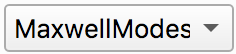

=========================
Tutorial Rolie-Poly
=========================

.. |logo| image:: /app_logo/NLVE.png
    :width: 20pt
    :height: 20pt
    :align: bottom

.. |logoLVE| image:: /app_logo/LVE.png
    :width: 20pt
    :height: 20pt
    :align: bottom

.. |import_modes| image:: /gui_icons/icons8-broadcasting.png
    :width: 20pt
    :height: 20pt
    :align: bottom

.. |einstein| image:: /gui_icons/icons8-einstein.png
    :width: 20pt
    :height: 20pt
    :align: bottom

.. |fit| image:: /gui_icons/icons8-minimum-value.png
    :width: 20pt
    :height: 20pt
    :align: bottom

.. |calculate| image:: /gui_icons/icons8-abacus.png
    :width: 20pt
    :height: 20pt
    :align: bottom

.. |eye| image:: /gui_icons/icons8-visible.png
    :width: 20pt
    :height: 20pt
    :align: bottom

.. |no_fene| image:: /gui_icons/icons8-infinite.png
    :height: 15pt
    :align: bottom

.. |fene| image:: /gui_icons/icons8-facebook-f.png
    :height: 15pt
    :align: bottom

	

	
.. |get_modes| image:: images/get_modes.png
    :height: 45pt
    :align: bottom

.. |nstretch| image:: images/nstretch.png
    :height: 15pt
    :align: bottom

.. |edit_modes| image:: images/edit_modes.png
    :width: 50pt
    :align: center
    :alt: Edit modes
	
	
**Non-Linear flow prediction**

#.  Start RepTate and create a new NLVE Application |logo|:
    
    .. image:: images/new_NLVE.png
        :width: 400pt
        :align: center
        :alt: New application
		
#.  Drag and drop shear (`.shear`) or uniaxial extension (`.uext`) data files, e.g. all the `.uext` files from the `data/DOW/Non-Linear_Rheology/Start-up_extension/` folder.

    The first column of the file should contain the time and the second column the viscosity (shear or tensile stress growth coefficient).

    .. image:: images/load_uext_data.png
        :width: 400pt
        :align: center
        :alt: Load data

#.  Select the "RoliePoly" theory |th_select| and press |einstein| to create it.

    .. image:: images/new_RP_th.png
        :width: 400pt
        :align: center
        :alt: New theory

    At this point, you need to setup the relaxation times, :math:`\tau_i`, and 
    weights, :math:`g_i`, for each mode :math:`i`.
    You can:

        - Input them manually by clicking:
          
          .. image:: images/edit_modes.png
              :width: 100pt
              :align: center
              :alt: Edit modes
	  
          then select the number of modes, enter the values and click "OK", then 
          minimize |fit|.
        
        - Alternatively, it is possible to copy the values from a file or spreadsheet
          and paste the values into the "Edit Modes" table.

        - Obtain the Maxwell modes from a different RepTate application (LVE, TTS, 
          G(t)).
          **In this tutorial we will import Maxwell modes from a LVE application.**

#.  Create a new LVE Application |logoLVE| (see :ref:`Tutorial LVE Application` for 
    more details)
    and open the linear viscoelastic data file corresponding to the **same sample** at
    the **same temperature**. 
    Then create a new Maxwell theory |maxwell| and minimize |fit|:
	
    .. image:: images/LVE_for_NLVE.png
        :width: 400pt
        :align: center
        :alt: LVE for NLVE

#.  Return to the NLVE application and now click |import_modes| and select from which 
    theory you want to import the modes |get_modes| and click "OK" and minimize |fit|:
	
	.. image:: images/RP_predictions.png
		:width: 400pt
		:align: center
		:alt: Theory prediction
 
#.  Click the |eye| button to show (or hide) the linear viscoelastic envelope
    prediction:
	
	.. image:: images/with_LVE.png
		:width: 400pt
		:align: center
		:alt: Show LVE

#.  The number of stretching modes is given by |nstretch|. :math:`N_\text{stretch}=0` 
    means that the non-stretching version of the Rolie-Poly model will be used for all 
    modes.
    So far, the calculations were done using "infinitely stretching chains" |no_fene|. 
    Click that button to use finite extensibility |fene|. The maximum extensibility
    parameter *lmax* is now present in the parameter table.
    You can change its value and click "calculate" |calculate| to update the theory 
    predictions
	
	.. image:: images/with_fene.png
		:width: 400pt
		:align: center
		:alt: With fene