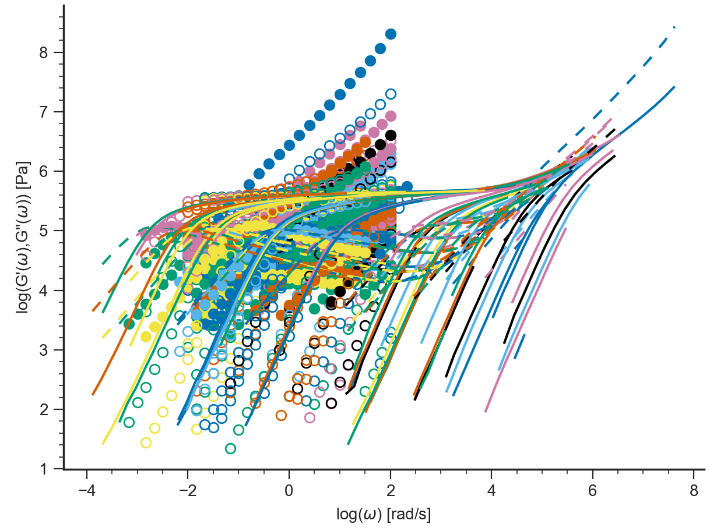

=====================================
Tutorial TTS Application Command Line
=====================================

.. toctree::
   :maxdepth: 2

.. hint::
	.. include:: /manual/Applications/All_Tutorials/tutorialCL_instructions.rst

**Time-Temperature shift**

    
#. Start Reptate and create LVE Application::

    > RepTate.py
    Reptate Version 0.5 command processor
    help [command] for instructions
    TAB for completions
    reptate> new LVE
    reptate/LVE1>

A new plot window for the new application is opened.

.. image:: images/newTTS.png
    :width: 400pt
    :align: center
    :alt: Empty Graph window

#. Create Dataset::

    reptate/LVE1> new
    reptate/LVE1/DataSet01>

#. Add files to the dataset (oscillatory shear files)::

    reptate/LVE1/DataSet01> open data/PI_LINEAR/osc/PI*osc

#. Plot the files using the default LVE Application view::

    reptate/LVE1/DataSet01> plot

The files are plotted (no legend is shown by default).

.. image:: images/plotOSCfiles.png
    :width: 400pt
    :align: center
    :alt: Empty Graph window

#. Create new WLF theory (the shift is calculated with the default values of the parameters)::

    reptate/LVE1/DataSet01> theory_new WLFShift
    
                    Mw      Error (  # Points)
    =============================================
                   1.9k          - (         0)
                   2.4k    0.12155 (       104)
                   5.1k   0.089966 (        78)
                  13.5k   0.093077 (       168)
                  23.4k   0.038122 (       262)
                  33.6k   0.021255 (       274)
                  94.9k  0.0028873 (       538)
                 225.9k  0.0030331 (      1070)
                 483.1k  0.0011465 (       438)
                 634.5k  0.0059321 (       326)
                  1131k 0.00039522 (       546)
                  TOTAL   0.015394 (      3804)
    reptate/LVE1/DataSet01/WLFShift01>

#. Change the value of a theory parameter::

    reptate/LVE1/DataSet01/WLFShift01> T0=-35
    
#. Fit the theory to the data files (in this case, shift according to WLF). After the fit is finished, the optimal values of the theory parameters are shown. Only those parameters marked with a ``*`` have been optimized. Also, the error per Mw is shown in a table, along with the number of points that were used for the fit, and the total error of the fit (the objective of the optimization)::

    reptate/LVE1/DataSet01/WLFShift01> fit
    Solution found with 134 function evaluations and error 0.000308087
    Parameter        Value
    ===========================
    *       C1 =     8.6894
    *       C2 =     113.95
            C3 =       0.61
           CTg =      14.65
            T0 =        -35
          dx12 =          0
          rho0 =      0.928
                    Mw      Error (  # Points)
    =============================================
                   1.9k          - (         0)
                   2.4k  0.0016871 (        86)
                   5.1k   0.001603 (        78)
                  13.5k  0.0017817 (       146)
                  23.4k 0.00061732 (       246)
                  33.6k 0.00027358 (       254)
                  94.9k 7.7759e-05 (       498)
                 225.9k 0.00017869 (      1056)
                 483.1k 5.7601e-05 (       436)
                 634.5k 0.00035651 (       326)
                  1131k 2.1141e-05 (       546)
                  TOTAL 0.00030825 (      3672)
    reptate/LVE1/DataSet01/WLFShift01>

.. image:: images/WLFfit.png
    :width: 400pt
    :align: center
    :alt: WLF shift with fitted parameters
    
#. Save theory predictions (by default, tts theory files are saved on the same folder from where the osc files were read)::
    
    reptate/LVE1/DataSet01/WLFShift01> save
    Saving prediction of WLFShift theory
    File: c:\Users\Jorge Ramírez\OneDrive\Codes\Python\RepTate\RepTate\data\PI_LINEAR\osc\PI_1.9k_-35.0.tts
    File: c:\Users\Jorge Ramírez\OneDrive\Codes\Python\RepTate\RepTate\data\PI_LINEAR\osc\PI_2.4k_-35.0.tts
    File: c:\Users\Jorge Ramírez\OneDrive\Codes\Python\RepTate\RepTate\data\PI_LINEAR\osc\PI_5.1k_-35.0.tts
    File: c:\Users\Jorge Ramírez\OneDrive\Codes\Python\RepTate\RepTate\data\PI_LINEAR\osc\PI_13.5k_-35.0.tts
    File: c:\Users\Jorge Ramírez\OneDrive\Codes\Python\RepTate\RepTate\data\PI_LINEAR\osc\PI_23.4k_-35.0.tts
    File: c:\Users\Jorge Ramírez\OneDrive\Codes\Python\RepTate\RepTate\data\PI_LINEAR\osc\PI_33.6k_-35.0.tts
    File: c:\Users\Jorge Ramírez\OneDrive\Codes\Python\RepTate\RepTate\data\PI_LINEAR\osc\PI_94.9k_-35.0.tts
    File: c:\Users\Jorge Ramírez\OneDrive\Codes\Python\RepTate\RepTate\data\PI_LINEAR\osc\PI_225.9k_-35.0.tts
    File: c:\Users\Jorge Ramírez\OneDrive\Codes\Python\RepTate\RepTate\data\PI_LINEAR\osc\PI_483.1k_-35.0.tts
    File: c:\Users\Jorge Ramírez\OneDrive\Codes\Python\RepTate\RepTate\data\PI_LINEAR\osc\PI_634.5k_-35.0.tts
    File: c:\Users\Jorge Ramírez\OneDrive\Codes\Python\RepTate\RepTate\data\PI_LINEAR\osc\PI_1131.0k_-35.0.tts
    reptate/LVE1/DataSet01/WLFShift01>
    
#. Exit Reptate (the y answer is needed)::

    reptate/LVE1/DataSet01/WLFShift01> quit
    Do you really want to exit RepTate? (y/N) y
    Exiting RepTate...    
