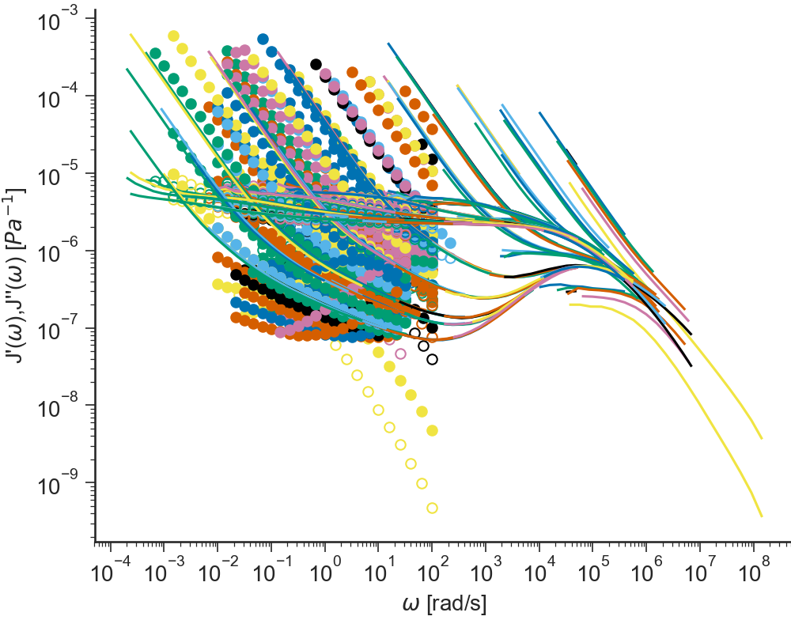
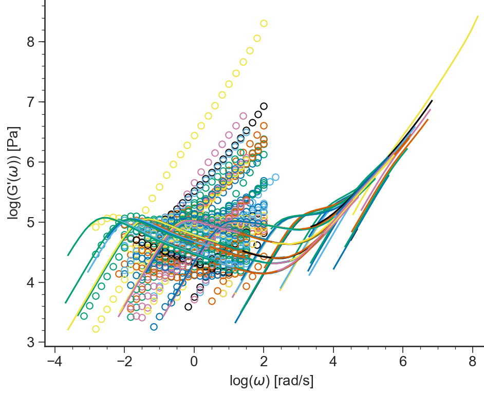
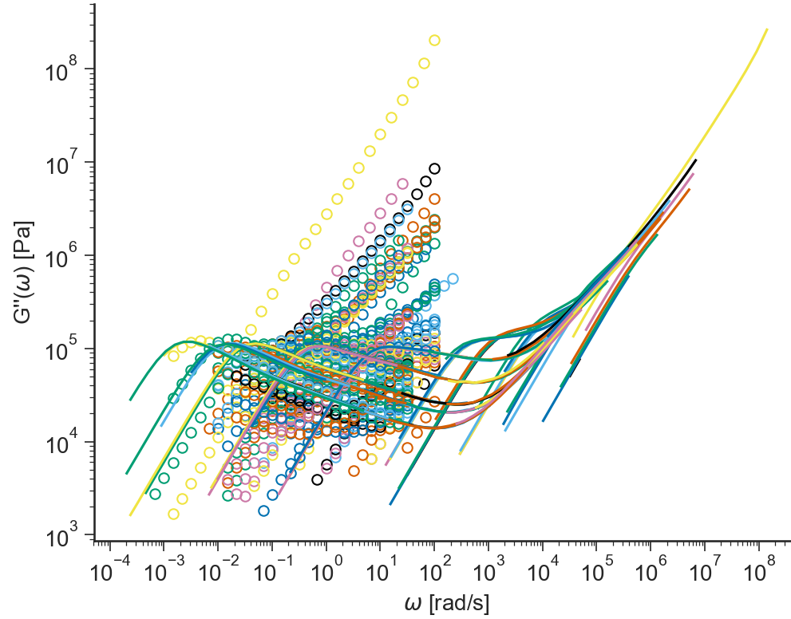

==================================
TTS: General description
==================================

.. contents:: Contents
    :local:

..	toctree::
   	:maxdepth: 2

-------
Purpose
-------

.. autoclass:: ApplicationTTS.ApplicationTTS()	

.. _TTS_Data_Description:

----------
Data Files
----------

.. include:: ../datafile_doc.rst

``.osc`` extension
-------------------

Text files with ``.osc`` extension should be organised as follows:

- ``.osc`` files should **at least** the value parameter values for the:

  #. sample molar mass ``Mw``,
  #. temperature ``T``.

- 3 columns separated by **spaces** or **tabs** containing respectively:

  #. frequency, :math:`\omega`,
  #. elastic modulus, :math:`G'`,
  #. loss modulus :math:`G''`.

Other columns will be ingnored. A correct ``.osc`` file looks like:

.. code-block:: none

  T=0;Mw=94.9;chem=PI;origin=LeedsDA;label=PI88k_09_PP-10;PDI=1.03;
  Freq	    G'	        G"	        Temp	    Strain
  rad/s	    Pa	        Pa	        °C	        %	
  100       3.4801E5    70871       -0.0079     0.96734
  68.129    3.328E5     70723       -0.0088     0.96362
  46.416    3.1675E5    71696       -0.0101     0.96238
  ...       ...         ...         ...         ...

-----
Views
-----

log(G',G"(w))
-------------------------------------------
.. automethod:: ApplicationTTS.BaseApplicationTTS.viewLogG1G2()
   
.. image:: images/TTS_logG1G2.png
    :width: 45%
    :align: center

G',G"(w)
--------------------------------
.. automethod:: ApplicationTTS.BaseApplicationTTS.viewG1G2()

.. image:: images/TTS_G1G2.png
    :width: 45%
    :align: center

etastar
----------------------
.. automethod:: ApplicationTTS.BaseApplicationTTS.viewEtaStar()

.. image:: images/TTS_etastar.png
    :width: 45%
    :align: center

logetastar
----------------------
.. automethod:: ApplicationTTS.BaseApplicationTTS.viewLogEtaStar()

.. image:: images/TTS_logetastar.png
    :width: 45%
    :align: center

delta    
----------------------
.. automethod:: ApplicationTTS.BaseApplicationTTS.viewDelta()

.. image:: images/TTS_delta.png
    :width: 45%
    :align: center

tan(delta)
----------------------------
.. automethod:: ApplicationTTS.BaseApplicationTTS.viewTanDelta()

.. image:: images/TTS_tandelta.png
    :width: 45%
    :align: center

log(tan(delta))
----------------------------
.. automethod:: ApplicationTTS.BaseApplicationTTS.viewLogTanDelta()

.. image:: images/TTS_logtandelta.png
    :width: 45%
    :align: center
    
log(G*)
----------------------------
.. automethod:: ApplicationTTS.BaseApplicationTTS.viewLogGstar()

.. image:: images/TTS_logGstar.png
    :width: 45%
    :align: center

log(tan(delta),G*)
----------------------------
.. automethod:: ApplicationTTS.BaseApplicationTTS.viewLogtandeltaGstar()

.. image:: images/TTS_logtandeltaGstar.png
    :width: 45%
    :align: center

delta(G*)
----------------------------
.. automethod:: ApplicationTTS.BaseApplicationTTS.viewdeltatanGstar()

.. image:: images/TTS_deltaGstar.png
    :width: 45%
    :align: center

J',J"(w)
----------------------------
.. automethod:: ApplicationTTS.BaseApplicationTTS.viewJ1J2()

Cole-Cole
----------------------------
.. automethod:: ApplicationTTS.BaseApplicationTTS.viewColeCole()

.. image:: images/TTS_ColeCole.png
    :width: 45%
    :align: center

log(G')
-------------------------------------------
.. automethod:: ApplicationTTS.BaseApplicationTTS.viewLogG1()

.. image:: images/TTS_logG1.png
    :width: 45%
    :align: center

G'
--------------------------------
.. automethod:: ApplicationTTS.BaseApplicationTTS.viewG1()

.. image:: images/TTS_G1.png
    :width: 45%
    :align: center

log(G")
-------------------------------------------
.. automethod:: ApplicationTTS.BaseApplicationTTS.viewLogG2()

G"
--------------------------------
.. automethod:: ApplicationTTS.BaseApplicationTTS.viewG2()

log(G',G"(w),tan(delta))
--------------------------------
.. automethod:: ApplicationTTS.BaseApplicationTTS.viewLogG1G2tandelta()

.. image:: images/TTS_logG1G2tandelta.png
    :width: 45%
    :align: center
