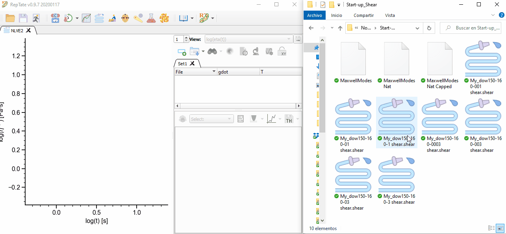
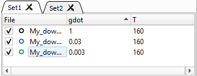
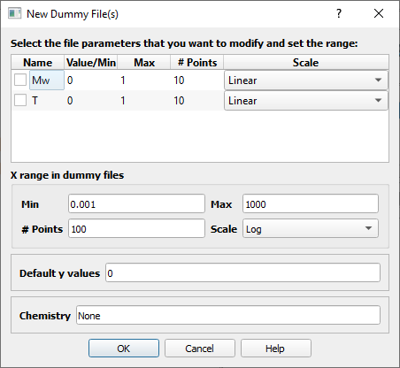

-----------------------
Operating with Datasets 
-----------------------

.. |open| image:: /gui_icons/icons8-open-view-in-new-tab.png
    :width: 15pt
    :height: 15pt
    :align: bottom

.. |newdataset| image:: /gui_icons/icons8-add-row.png
    :width: 15pt
    :height: 15pt
    :align: bottom

.. |excel| image:: /gui_icons/icons8-microsoft-excel.png
    :width: 15pt
    :height: 15pt
    :align: bottom

.. |viewall| image:: /gui_icons/icons8-binoculars.png
    :width: 20pt
    :height: 20pt
    :align: bottom

.. |filereload| image:: /gui_icons/icons8-file-reload.png
    :width: 20pt
    :height: 20pt
    :align: bottom

When an new application is opened, a new tab is created in the Main RepTate window, showing an empty application with an empty dataset, no theories and the default view. New data files must be added to the dataset in order to use all the functionality of RepTate. 

Structure of data files
------------------------

Only text files that have the right extension and contain the expected data can be added to the current application. The general structure of the text files that can be read by RepTate is as follows (see the example below for a quick reference):

- [**Required**] The first line contains a **list of parameters** that describe the contents of the data in the file, as a list of variables and values separated by semicolons. Typically, the parameters will describe the conditions (temperature, pressure, etc) at which the experiment was done, plus some additional parameters to characterize the material (chemistry, molecular weight, etc) and the author of the data. Some parameters are needed by some applications and theories (for example, the temperature in the TTS module) and RepTate will show a warning if their values are missing. The values of the parameters can be real numbers, integers or strings.
- [**Optional**] Some **additional text lines** may be present in the file with further info about the experimental data (the date and location where the data was taken, the equipment, etc). These lines ignored by RepTate.
- [**Required**] The **data** itself must be stored in the file as **columns separated by spaces or tabs**. The number of columns must be greater or equal than the number of columns required by the application, and in the expected order. Additional columns are discarded. For more information, check the documentation for each particular application.

.. code-block:: none
  
  var1=value1;var2=value2;var3=value3;...
  Some text
  # Some text
  1.90165E+0      7.38023E+1      1.35152E+4   
  3.01392E+0      1.99063E+1      2.14834E+4   
  4.51700E+0      3.72861E+1      3.17756E+4   
  ...             ...             ...                    

For more info about valid extensions and data structure inside the files, check the documentation for each application. 

Adding files to datasets
------------------------

There are two ways to add Files to the current application:

- By dragging and dropping them from the system file explorer to the Application window (see :numref:`figdragdrop`). 
- By pressing the Open Data File button |open| (Ctrl+O). A file dialog is shown where one file or more files of the right type can be selected.

.. _figdragdrop:

    	
    Dragging and dropping some files to the RepTate window.

Importing data from Excel files
-------------------------------

This feature is experimental and will be improved in the future. In the current version, when the user selects the button "Import from Excel" |excel|, under the button |open| menu, a dialog is shown that allows the user to (see :numref:`figimportexcel`):

- select the Excel file
- set the file parameters
- select Excel Sheet that contains the data 
- set the number of rows in the Excel sheet that must be skipped
- set the columns in the Excel sheet that correspond to the columns that the RepTate application expects to read. 

.. _figimportexcel:
.. figure:: images/ImportfromExcel.png
    :width: 50%
    :align: center
    	
    Importing data from an Excel file into the LVE application.

Sorting Files in a Dataset
--------------------------

The files in a Dataset can be sorted by name or parameter value, in increasing and decreasing order, by clicking in the corresponding column header. Clicking several times on the same header will invert the sorting order. A small arrow next to a column header name will indicate how the files in the current Dataset are sorted (see :numref:`figsortfiles`). 

.. _figsortfiles:

    	
    A Dataset with files sorted by decreasing value of the *gdot* parameter.

When the files in a Dataset are sorted, the colours assigned to each file are also changed. The order of the colours is assigned by the selected palette. The number of colours in some palettes is limited and, therefore, if the number of files exceed the number of colours available, some files may end up having the same colour.

Viewing/Hiding Files
-----------------------------

Each file in a Dataset can be in the enabled (checked) or disabled state (unchecked, see :numref:`figdisablefile`). When files are disabled, they are not shown in the current view and they are not considered during theory calculation and fitting. 

.. _figdisablefile:
.. figure:: images/disablingfiles.gif
    :width: 50%
    :align: center
    	
    Enabling/disabling files in a Dataset.

Showing/Editing file parameters
-------------------------------

By double-clicking on a file name in the Dataset area, it is possible to view/edit the parameters of the file. A dialog will open, where all the file parameters are shown and all their values can be viewed/edited. 

Creating new datasets 
---------------------

Sometimes, it is convenient to load data into separate data sets, because the data correspond to different materials or the experiments have been done in different conditions. In order to create a new empty dataset, the user must click on the "Create an empty DataSet" button |newdataset| (Ctrl+N) in the DataSet toolbar. By default, new DataSets are named Set *i*, where *i* is an integer that starts from 1 and increments as new DataSets are opened. The DataSet name can be changed by double-clicking on the DataSet tab. 

When there are more than one Dataset in the current application, the user can switch Datasets by clicking on the corresponding tab. By default, RepTate only plots the data in the currently active Dataset. If the button "View all Datasets simultaneously" button |viewall| is clicked, all the data in all open Datasets is shown.

Adding *Dummy* files to datasets
--------------------------------

In some cases, the user may want to explore the results of a given theory but he/she does not have any experimental data files available. Since the theories are only applied to the active files of the Dataset that owns the theory, it is convenient to be able to create *empty* files with parameters that span some range of values of interest (for example, the user may be interested in exploring the results of some theory when the molecular weight of the samples is changed). In RepTate, this can be done by adding *Dummy files*, in the submenu under the "Open Data File" button. 

When the "Add Dummy files" button is clicked, a dialog is shown allowing the user to configure how the files are going to be generated (see :numref:`figdummyfiles`):

- The parameter(s) that are going to be changed systematically in the dummy files. By default, the possible parameters are selected from the list of *important* parameters, defined for every application. By ticking the check-box next to a parameter, it is selected.
- The range of values over which the parameter will be swept, which is defined by a minimum value, a maximum value, the number of points and scale (linear or logarithmic) that will be used to separate the points between the minumum and the maximum.
- The data in the dummy files is arbitrary. The user can select the range, number of points and scale (linear or log) in the dummy file for the first column (which frequently will act as the *x*-coordinate in views), as well as the default *y* value for the remaining columns. 
- The user can also input the chemistry, which may be interesting if a certain material is available in the Materials Database.

.. _figdummyfiles:

    	
    Dialog for adding *Dummy* files to a DataSet.

Reloading the data
------------------

Some times, the user may be representing some data that is being updated in real time (because an experiment or simulation is running at the same time as the RepTate session). In this cases, it is interesting to update the data in RepTate by reading again the file. This can be done by clicking the button "Reload Data Files & Theories" |filereload| (Ctrl+R).

