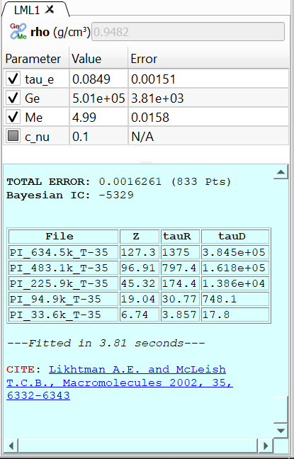
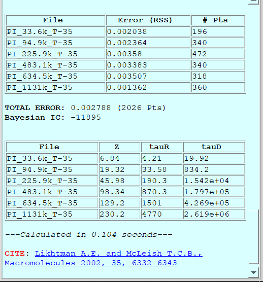

-----------------------
Fitting a theory 
-----------------------

.. |newtheory| image:: /gui_icons/icons8-einstein.png
    :width: 15pt
    :height: 15pt
    :align: bottom

.. |calculatetheory| image:: /gui_icons/icons8-abacus.png
    :width: 15pt
    :height: 15pt
    :align: bottom

One of the most important features of RepTate is the ability to easily fit a theory to a set of experimental data files. The available theories in each RepTate application are described and discussed in the documentation corresponding to each application. Here, we give a short summary of the general ideas about how theories are handled in RepTate. 

It is important to note that, in RepTate, theories *belong* to Datasets, *i.e.* they are applied only to the data files in the Dataset under which the theory was created. 

Opening a new Theory
--------------------

Below the Dataset table that contains the files, there is a toolbar for operating with theories. First, the user should select a theory from the list available in the drop-down menu. Once the right theory is selected, a new instance of the theory can be created by clicking on the "Create Selected Theory" button |newtheory| (Alt+N). New theories are shown as tabs below the theory toolbar. By default, theories are named after a combination of capital letters selected after the theory name + an index number. The name of any theory can be changed by double clicking on the corresponding tab.

Viewing/Editing Parameter values and options
--------------------------------------------

When a new theory instance is created, a new tab opens in which two clearly separate areas can be seen (see :numref:`figtheoryarea`):

- A table that lists the parameters of the theory, with their current value and, if the theory has been fitted to some experimental data, the error of the fitting. 
- A text area with a light blue background that shows all the relevant information during the calculation and fitting of the theory, as well as any citation information that is relevant to the current theory.

.. _figtheoryarea:

    	
    A theory with the parameters table and the log area (with cyan background).

Theory parameters can be shown in the table in three possible states:

    - Checked: the parameter value will be optimized during the fitting procedure.
	- Unchecked: the value of the parameter will not be optimized (it will remain constant during the next fitting procedure).
	- Grayed out or partially checked: the parameter cannot be optimized. This is intended for parameters, like exponents of scaling factors, that take well known values. Typically, *grayed* parameters take their value from a set of prescribed discrete values. 

Theory parameters have properties, and some of these properties are very important during theory fitting. In order to check and edit the properties of parameters, the user can double-click on any parameter name. Then, a dialog is shown with a tablist, with a tab for each parameter of the theory and the current properties of each parameter (see :numref:`figparameterproperties`). The most important properties of a parameter are:

- **name**: the short name of the parameter. It is hardcoded into the theory and cannot be changed.
- **description**: a short description of the parameter. It is hardcoded into the theory and cannot be changed.
- **type**: the numerical type of the value of the parameter. It can be *real*, *integer*, *discrete_real* (its value is selected from a discrete list of real values), *discrete_integer* (discrete list of integer values) and *boolean*. 
- **opt_type**: indicates whether the parameter value will be optimized during the fitting procedure or not. Possible states are: *opt* (will be optimized), *nopt* (will not be optimized) and *const* (cannot be optimized).
- **min_value**: minimum value that the parameter can adopt. If the parameter is not bounded, the minimum value is *-inf*.
- **max_value**: maximum value that the parameter can adopt. If the parameter is not bounded, the maximum value is *inf*. The bounds should not be exceeded during minimization. If the user inputs manually a value that is outside the bounds, RepTate will issue a warning and set the parameter value to the bound that has been exceeded.
- **display_flag**: whether the parameter will be shown in the parameter table or not.
- **discrete_values**: comma-separated list of values that the parameter can adopt. Only relevant if the parameter type is either *discrete_real* or *discrete_integer*.

.. _figparameterproperties:
.. figure:: images/ParameterProperties.png
    :width: 40%
    :align: center
    	
    Dialog for viewing/editing parameter properties.

Calculating the theory
----------------------

When the button "Calculate Theory" |calculatetheory| (Alt+C) is pressed, the theory is calculated using the current values of the theory parameters and for all the files in the current dataset. Since the theory may use some of the file parameters, the result of applyting the theory to each files will be different. By default, the theory is calculated exactly in the same *x* points as the corresponding data file. This can be changed by editing the file parameters and selecting "Extra Theory Range". 

When the theory calculation is done, some interesting information is shown in the theory log area (see :numref:`figtheorycalclog`). By default, the information displayed contains:

- A table with the list of files that theory has been applied to, with the error (calculated as the residual sum of squares, RSS) and the number of points of each file. 
- The total error (the weighted sum of the RSS errors of all the files) and the total number of points.
- The Bayesian Information Criterion (BIC), defined as :math:`BIC = n \log(RSS/n)+ p\log(n)`, where *n* is the number of data points and *p* is the number of free fitting parameters. In general, the model with the lowest BIC value should be preferred. 
- Some additional information may be shown by some theories (for example, in :numref:`figtheorycalclog`, the Likhtman-McLeish theory shows some tube related values for each file). 
- The time it took to calculate the theory, in seconds. 
- The relevant literature that the user should cite if he/she intends to use the results from the theory. The journal articles are shown as links that can be clicked in order to visit the publisher web.

.. _figtheorycalclog:

    	
    Example of the information displayed after a theory calculation is finished.

Fitting the theory
------------------

How the fitting is done
-----------------------

Setting x and y-range limits to the fitting graphically
-------------------------------------------------------

Fitting options
---------------

Saving theory predictions
-------------------------

Copying/Pasting theory parameters
---------------------------------

Showing all theories applied to current DataSet
-----------------------------------------------
