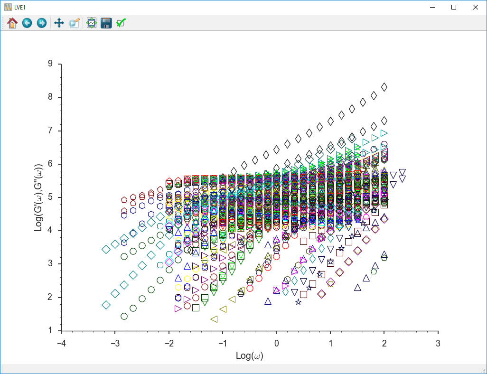

================
RepTate Tutorial
================

Tutorial files can be found in the **tutorial** folder. They can be run in batch mode or in interactive mode. 

- To run them in **interactive** mode, introduce the lines in the file (except the comments, which start with ``#`` and the line ``console batch``) one by one and wait for the results.

- To run them in **batch** mode, you can execute ``RepTate.py < tutorial\TEST_WLFShift.txt`` (or your tutorial of choice) and the output will be shown in the command line. In batch mode, no graphs or plots are shown.

Time-Temperature shift
----------------------
    
#. Start Reptate and create LVE Application::

    > RepTate.py
    Reptate Version 0.5 command processor
    help [command] for instructions
    TAB for completions
    reptate> new LVE
    reptate/LVE1>

A new plot window for the new application is opened.

.. image:: tutorial_images/newLVE.png
    :width: 400pt
    :align: center
    :alt: Empty Graph window

#. Create Dataset::

    reptate/LVE1> new
    reptate/LVE1/DataSet01>

#. Add files to the dataset (oscillatory shear files)::

    reptate/LVE1/DataSet01> open data/PI_LINEAR/osc/PI*osc

#. Plot the files using the default LVE Application view::

    reptate/LVE1/DataSet01> plot

The files are plotted (no legend is shown by default).

#. Create new WLF theory (the shift is calculated with the default values of the parameters)::

    reptate/LVE1/DataSet01> theory_new WLFShift
    
                    Mw      Error (  # Points)
    =============================================
                   1.9k          - (         0)
                   2.4k    0.12155 (       104)
                   5.1k   0.089966 (        78)
                  13.5k   0.093077 (       168)
                  23.4k   0.038122 (       262)
                  33.6k   0.021255 (       274)
                  94.9k  0.0028873 (       538)
                 225.9k  0.0030331 (      1070)
                 483.1k  0.0011465 (       438)
                 634.5k  0.0059321 (       326)
                  1131k 0.00039522 (       546)
                  TOTAL   0.015394 (      3804)
    reptate/LVE1/DataSet01/WLFShift01>

.. image:: tutorial_images/WLFdefault.png
    :width: 400pt
    :align: center
    :alt: WLF shift with default parameters

#. Change the value of a theory parameter::

    reptate/LVE1/DataSet01/WLFShift01> T0=-35
    
#. Fit the theory to the data files (in this case, shift according to WLF). After the fit is finished, the optimal values of the theory parameters are shown. Only those parameters marked with a ``*`` have been optimized. Also, the error per Mw is shown in a table, along with the number of points that were used for the fit, and the total error of the fit (the objective of the optimization)::

    reptate/LVE1/DataSet01/WLFShift01> fit
    Solution found with 134 function evaluations and error 0.000308087
    Parameter        Value
    ===========================
    *       C1 =     8.6894
    *       C2 =     113.95
            C3 =       0.61
           CTg =      14.65
            T0 =        -35
          dx12 =          0
          rho0 =      0.928
                    Mw      Error (  # Points)
    =============================================
                   1.9k          - (         0)
                   2.4k  0.0016871 (        86)
                   5.1k   0.001603 (        78)
                  13.5k  0.0017817 (       146)
                  23.4k 0.00061732 (       246)
                  33.6k 0.00027358 (       254)
                  94.9k 7.7759e-05 (       498)
                 225.9k 0.00017869 (      1056)
                 483.1k 5.7601e-05 (       436)
                 634.5k 0.00035651 (       326)
                  1131k 2.1141e-05 (       546)
                  TOTAL 0.00030825 (      3672)
    reptate/LVE1/DataSet01/WLFShift01>

.. image:: tutorial_images/WLFfit.png
    :width: 400pt
    :align: center
    :alt: WLF shift with fitted parameters
    
#. Save theory predictions (by default, tts theory files are saved on the same folder from where the osc files were read)::
    
    reptate/LVE1/DataSet01/WLFShift01> save
    Saving prediction of WLFShift theory
    File: c:\Users\Jorge Ramírez\OneDrive\Codes\Python\RepTate\RepTate\data\PI_LINEAR\osc\PI_1.9k_-35.0.tts
    File: c:\Users\Jorge Ramírez\OneDrive\Codes\Python\RepTate\RepTate\data\PI_LINEAR\osc\PI_2.4k_-35.0.tts
    File: c:\Users\Jorge Ramírez\OneDrive\Codes\Python\RepTate\RepTate\data\PI_LINEAR\osc\PI_5.1k_-35.0.tts
    File: c:\Users\Jorge Ramírez\OneDrive\Codes\Python\RepTate\RepTate\data\PI_LINEAR\osc\PI_13.5k_-35.0.tts
    File: c:\Users\Jorge Ramírez\OneDrive\Codes\Python\RepTate\RepTate\data\PI_LINEAR\osc\PI_23.4k_-35.0.tts
    File: c:\Users\Jorge Ramírez\OneDrive\Codes\Python\RepTate\RepTate\data\PI_LINEAR\osc\PI_33.6k_-35.0.tts
    File: c:\Users\Jorge Ramírez\OneDrive\Codes\Python\RepTate\RepTate\data\PI_LINEAR\osc\PI_94.9k_-35.0.tts
    File: c:\Users\Jorge Ramírez\OneDrive\Codes\Python\RepTate\RepTate\data\PI_LINEAR\osc\PI_225.9k_-35.0.tts
    File: c:\Users\Jorge Ramírez\OneDrive\Codes\Python\RepTate\RepTate\data\PI_LINEAR\osc\PI_483.1k_-35.0.tts
    File: c:\Users\Jorge Ramírez\OneDrive\Codes\Python\RepTate\RepTate\data\PI_LINEAR\osc\PI_634.5k_-35.0.tts
    File: c:\Users\Jorge Ramírez\OneDrive\Codes\Python\RepTate\RepTate\data\PI_LINEAR\osc\PI_1131.0k_-35.0.tts
    reptate/LVE1/DataSet01/WLFShift01>
    
#. Exit Reptate (the y answer is needed)::

    reptate/LVE1/DataSet01/WLFShift01> quit
    Do you really want to exit RepTate? (y/N) y
    Exiting RepTate...    
    

Likhtman-McLeish theory
-----------------------

Prediction of LVE data of linear polymer melts

#. Start Reptate and create LVE Application::

    > RepTate.py
    Reptate Version 0.5 command processor
    help [command] for instructions
    TAB for completions
    reptate> new LVE
    reptate/LVE1>

#. Create Dataset::

    new
    
#. Add files to the dataset (master curve tts files)::

    open data/PI_LINEAR/PI_13.5k_T-35.tts
    open data/PI_LINEAR/PI_23.4k_T-35.tts
    open data/PI_LINEAR/PI_33.6k_T-35.tts
    open data/PI_LINEAR/PI_94.9k_T-35.tts
    open data/PI_LINEAR/PI_225.9k_T-35.tts
    open data/PI_LINEAR/PI_483.1k_T-35.tts
    open data/PI_LINEAR/PI_634.5k_T-35.tts
    open data/PI_LINEAR/PI_1131k_T-35.tts
    
#. Plot the files using the default LVE Application view::

    plot

#. View the legend. By default, the legend shows the most important file parameters, according to the corresponding file type.

    legend

#. Create new theory (calculation is done with default paramter values)::

    theory_new Likhtman-McLeish
                            File      Error (  # Points)
           =============================================
    data/PI_LINEAR/PI_13.5k_T-35     25.368 (       130)
    data/PI_LINEAR/PI_23.4k_T-35     24.142 (       188)
    data/PI_LINEAR/PI_33.6k_T-35     22.957 (       196)
    data/PI_LINEAR/PI_94.9k_T-35     14.238 (       340)
    data/PI_LINEAR/PI_225.9k_T-35    12.748 (       472)
    data/PI_LINEAR/PI_483.1k_T-35    10.176 (       340)
    data/PI_LINEAR/PI_634.5k_T-35     9.179 (       318)
    data/PI_LINEAR/PI_1131k_T-35     7.8555 (       360)
                           TOTAL     13.823 (      2344)

#. Fit the theory to the data files ()::

    fit
    OptimizeWarning: Covariance of the parameters could not be estimated category=OptimizeWarning)
    Solution found with 85 function evaluations and error 0.00415354
        Parameter        Value +/-      Error (if it was optimized)
        =============================================
             Ge = 4.8317e+05 +/-        inf
             Me =          5 +/-        inf
            cnu =        0.1
           taue =     0.1029 +/-        inf
                            File      Error (  # Points)
          =============================================
    data/PI_LINEAR/PI_13.5k_T-35  0.0066726 (       130)
    data/PI_LINEAR/PI_23.4k_T-35  0.0092436 (       188)
    data/PI_LINEAR/PI_33.6k_T-35  0.0027997 (       196)
    data/PI_LINEAR/PI_94.9k_T-35  0.0029624 (       340)
    data/PI_LINEAR/PI_225.9k_T-35 0.0070505 (       472)
    data/PI_LINEAR/PI_483.1k_T-35 0.0026445 (       340)
    data/PI_LINEAR/PI_634.5k_T-35  0.002892 (       318)
    data/PI_LINEAR/PI_1131k_T-35  0.0011891 (       360)
                           TOTAL  0.0041535 (      2344)    

#. Save theory predictions. Files with extension _th.tts are saved in the same folder where the experimental data was found.::
    
    save
    Saving prediction of Likhtman-McLeish theory
    File: data/PI_LINEAR/PI_13.5k_T-35
    File: data/PI_LINEAR/PI_23.4k_T-35
    File: data/PI_LINEAR/PI_33.6k_T-35
    File: data/PI_LINEAR/PI_94.9k_T-35
    File: data/PI_LINEAR/PI_225.9k_T-35
    File: data/PI_LINEAR/PI_483.1k_T-35
    File: data/PI_LINEAR/PI_634.5k_T-35
    File: data/PI_LINEAR/PI_1131k_T-35
    
#. Exit Reptate (the y answer is needed)::
    
    quit
    
Fit Maxwell modes to LVE
------------------------

#. Create LVE Application::

    new LVE

#. Create Dataset::

    new

#. Add files to the dataset (master curve tts files)::
    
    open data/PI_LINEAR/PI_483.1k_T-35.tts

#. Plot the files using the default LVE Application view::

    plot
    
#. Create new theory::

    theory_new MaxwellModesFrequency
    
#. Set the xrange for the fitting (wrt the current view)::

    xrange -8 -3
    
#.Change the number of Maxwell modes::

    nmodes=5
    
#. Fit the theory to the data files::

    fit
    
#. Save theory predictions::

    save
    
#. Exit Reptate (the y answer is needed)::

    quit

Rolie-Poly shear flow
---------------------

#. Comment the following line for command line mode (with graphical windows)::
    
    console batch
    
#. First create LVE application to fit Maxwell Modes::
    
    new LVE
    new
    open data/DOW/Linear_Rheology_TTS\DOWLDPEL150R_160C.tts
    theory_new MaxwellModesFrequency
    nmodes=8
    fit
    up
    up
    up
    
#. Create NLVE Application::
    
    new NLVE
    
#. Create Dataset::

    new
    
#. Add files to the dataset (master curve tts files)::

    open data\DOW\Non-Linear_Rheology\Start-up_Shear\My_dow150-160-*
    
#. Plot the files using the default LVE Application view::

    plot
    
#. Create new theory::
    
    theory_new RoliePoly
    
#. Return to the main application manager::

    up
    up
    up
    
#. Copy the Maxwell modes previously calculated::

    copymodes LVE1.DataSet01.MaxwellModesFrequency01 NLVE2.DataSet01.RoliePoly01
    
#. Return to the RoliePoly Theory::
    
    switch NLVE2
    switch DataSet01
    theory_switch RoliePoly01
    
#. Calculate the theory to the data files (in this case, shift according to WLF)::

    calculate
    
#. Save theory predictions::

    save
    
#. Exit Reptate (the y answer is needed)::

    quit
