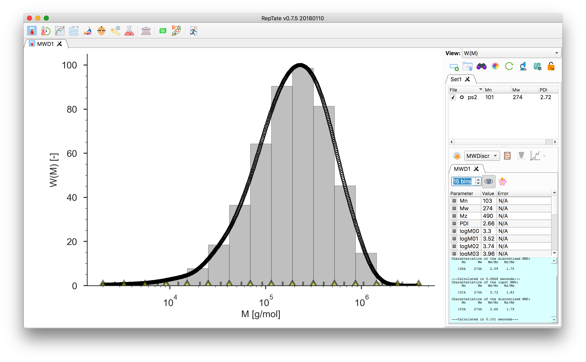
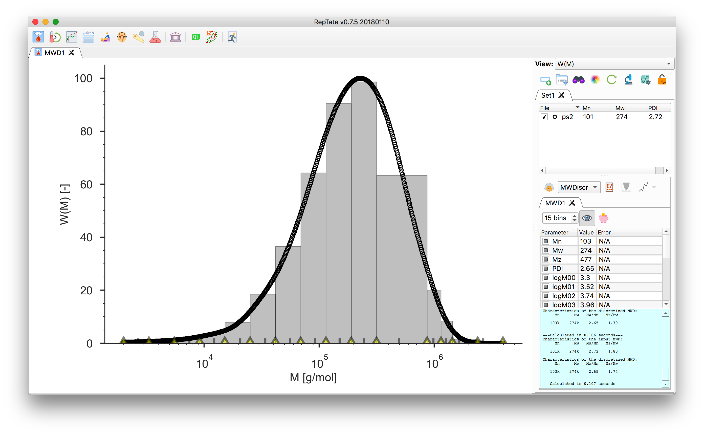

========================
Tutorial MWD Application
========================

.. toctree::
   :maxdepth: 2

Discretisation of a GPC molecular weight distribution weight discretisation
-------------------------------

#. Start Reptate and create MWD Application::

.. image:: GUI_tutorial_images/open_MWD_app.png
    :width: 400pt
    :align: center
    :alt: Empty Graph window

#. Drag and drop a file with a `.gpc` extension, e.g. `data/PS_Linear_Polydisperse/ps2.gpc`::

.. image:: GUI_tutorial_images/open_gpc_file.png
    :width: 400pt
    :align: center
    :alt: Empty Graph window

#. Select `MWDiscr` and press `create selected theory`.:
`M_n`, `M_w` and `PDI` values of the original data are calculated and:
reported into the file parameters panel.:
The parameter panel shows these values for the discretised distribution.::

.. image:: GUI_tutorial_images/create_MWDiscr_theory.png
    :width: 400pt
    :align: center
    :alt: Empty Graph window

#. Adjust the number of molecular weight bins by changing the value in the theory panel.:
By default they are equally spaces on a logarithmic scale.::

#. In the bottom of the plot, the grey tick marks indicate the bin molecular weight.:
It is taken as the $M_w$ value across the bin width. The yellow markers indicate the bin edges, they can be dragged around.::

#. Click the 'piggy bank' button to save the discretised molecular weight.:
The file contains a header with the moments and PDI and two columns.:
The first column is the molecular weight as indicated by the grey tick,:
the second column is the value of the area of the covered by the bin.:
The total area being equal to 1.::

