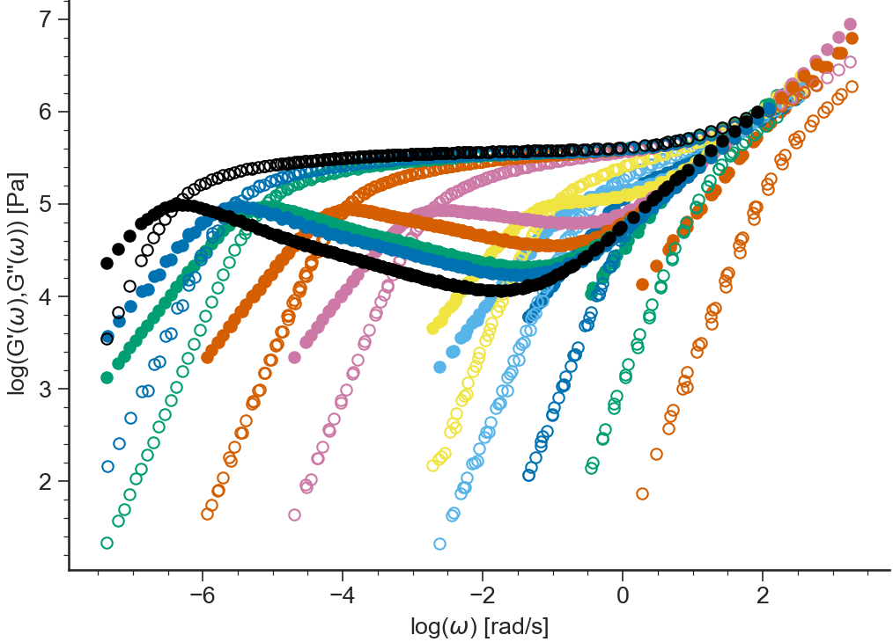
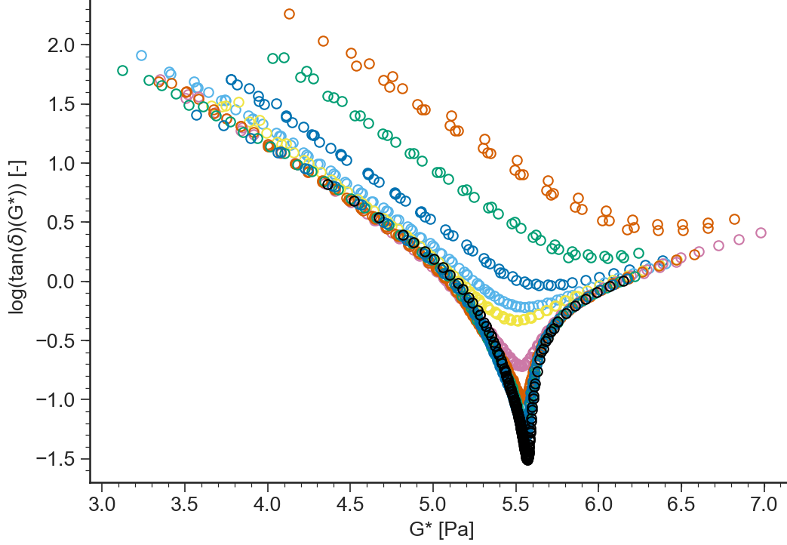
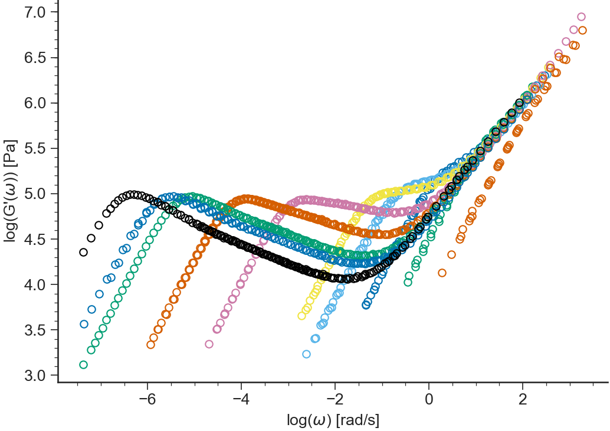
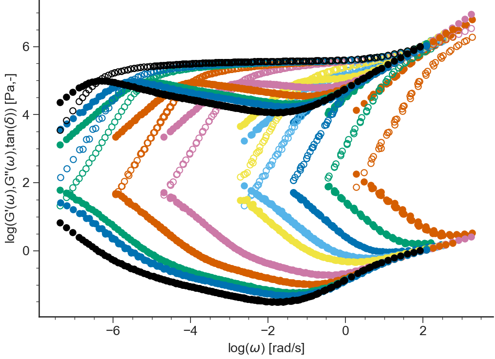

========================
LVE: General Description
========================

.. contents:: Contents
    :local:

..	toctree::
   	:maxdepth: 2

-------
Purpose
-------

.. automodule:: RepTate.applications.ApplicationLVE.ApplicationLVE()	

.. _LVE_Data_Description:

----------
Data Files
----------

.. include:: ../datafile_doc.rst

``.tts`` extension
-------------------

Text files with ``.tts`` extension should be organised as follows:

- ``.tts`` files should contain **at least** the parameter values for the:

  #. sample molar mass ``Mw``,
  #. temperature ``T``.

- 3 columns separated by **spaces** or **tabs** containing respectively:

  #. frequency, :math:`\omega`,
  #. elastic modulus, :math:`G'`,
  #. loss modulus :math:`G''`.

Other columns will be ignored. A correct ``.tts`` file looks like:

.. code-block:: none
  
  T=-35;CTg=14.65;dx12=0;isof=true;Mw=13.5;chem=PI;PDI=1.04;
  1.90165521264016E+0000      7.38023647054321E+0001      1.35152457625702E+0004     -2.99910000000000E+0001
  3.01392554124040E+0000      1.99063258930248E+0002      2.14834778959042E+0004     -2.99900000000000E+0001
  4.51700049635957E+0000      3.72861375546198E+0002      3.17756716623334E+0004     -3.99960000000000E+0001
  ...                         ...                         ...                        ...

-----
Views
-----

log(G',G"(w))
-------------------------------------------
.. automethod:: RepTate.applications.ApplicationLVE.BaseApplicationLVE.viewLogG1G2()
   

G',G"(w)
--------------------------------
.. automethod:: RepTate.applications.ApplicationLVE.BaseApplicationLVE.viewG1G2()

.. image:: images/LVE_G1G2.png
    :width: 45%
    :align: center

etastar
----------------------
.. automethod:: RepTate.applications.ApplicationLVE.BaseApplicationLVE.viewEtaStar()

.. image:: images/LVE_etastar.png
    :width: 45%
    :align: center

logetastar
----------------------
.. automethod:: RepTate.applications.ApplicationLVE.BaseApplicationLVE.viewLogEtaStar()

.. image:: images/LVE_logetastar.png
    :width: 45%
    :align: center

delta    
----------------------
.. automethod:: RepTate.applications.ApplicationLVE.BaseApplicationLVE.viewDelta()

.. image:: images/LVE_delta.png
    :width: 45%
    :align: center

tan(delta)
----------------------------
.. automethod:: RepTate.applications.ApplicationLVE.BaseApplicationLVE.viewTanDelta()

.. image:: images/LVE_tandelta.png
    :width: 45%
    :align: center

log(tan(delta))
----------------------------
.. automethod:: RepTate.applications.ApplicationLVE.BaseApplicationLVE.viewLogTanDelta()

.. image:: images/LVE_logtandelta.png
    :width: 45%
    :align: center
    
log(G*)
----------------------------
.. automethod:: RepTate.applications.ApplicationLVE.BaseApplicationLVE.viewLogGstar()

.. image:: images/LVE_logGstar.png
    :width: 45%
    :align: center

log(tan(delta),G*)
----------------------------
.. automethod:: RepTate.applications.ApplicationLVE.BaseApplicationLVE.viewLogtandeltaGstar()

delta(G*)
----------------------------
.. automethod:: RepTate.applications.ApplicationLVE.BaseApplicationLVE.viewdeltatanGstar()

.. image:: images/LVE_deltaGstar.png
    :width: 45%
    :align: center

J',J"(w)
----------------------------
.. automethod:: RepTate.applications.ApplicationLVE.BaseApplicationLVE.viewJ1J2()

.. image:: images/LVE_J1J2.png
    :width: 45%
    :align: center

Cole-Cole
----------------------------
.. automethod:: RepTate.applications.ApplicationLVE.BaseApplicationLVE.viewColeCole()

.. image:: images/LVE_ColeCole.png
    :width: 45%
    :align: center

log(G')
-------------------------------------------
.. automethod:: RepTate.applications.ApplicationLVE.BaseApplicationLVE.viewLogG1()

.. image:: images/LVE_logG1.png
    :width: 45%
    :align: center

G'
--------------------------------
.. automethod:: RepTate.applications.ApplicationLVE.BaseApplicationLVE.viewG1()

.. image:: images/LVE_G1.png
    :width: 45%
    :align: center

log(G")
-------------------------------------------
.. automethod:: RepTate.applications.ApplicationLVE.BaseApplicationLVE.viewLogG2()

G"
--------------------------------
.. automethod:: RepTate.applications.ApplicationLVE.BaseApplicationLVE.viewG2()

.. image:: images/LVE_G2.png
    :width: 45%
    :align: center

log(G',G"(w),tan(delta))
--------------------------------
.. automethod:: RepTate.applications.ApplicationLVE.BaseApplicationLVE.viewLogG1G2tandelta()

