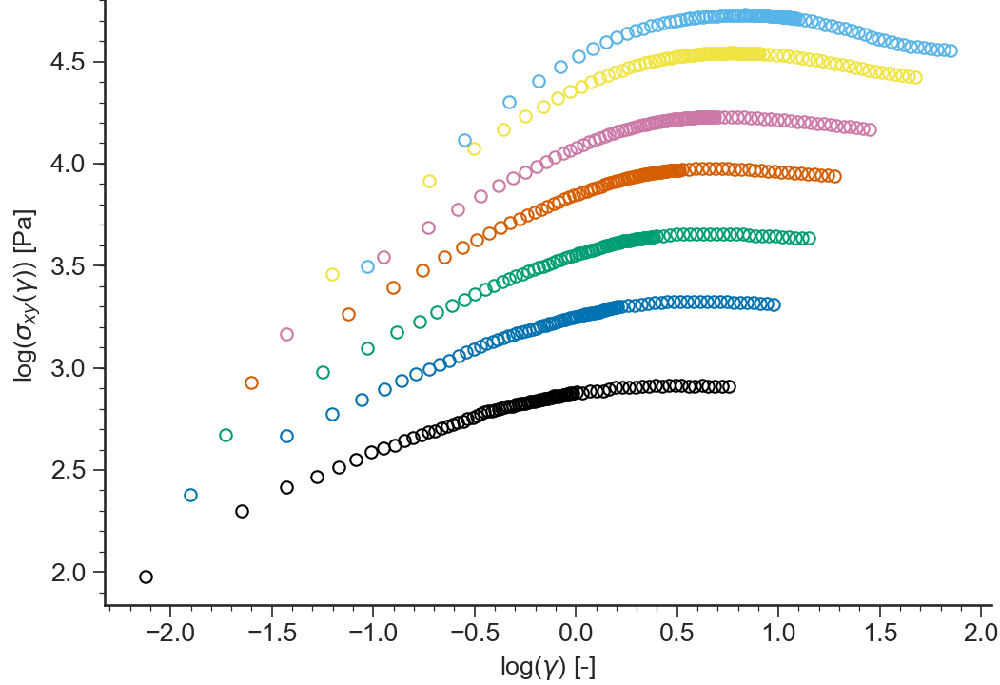
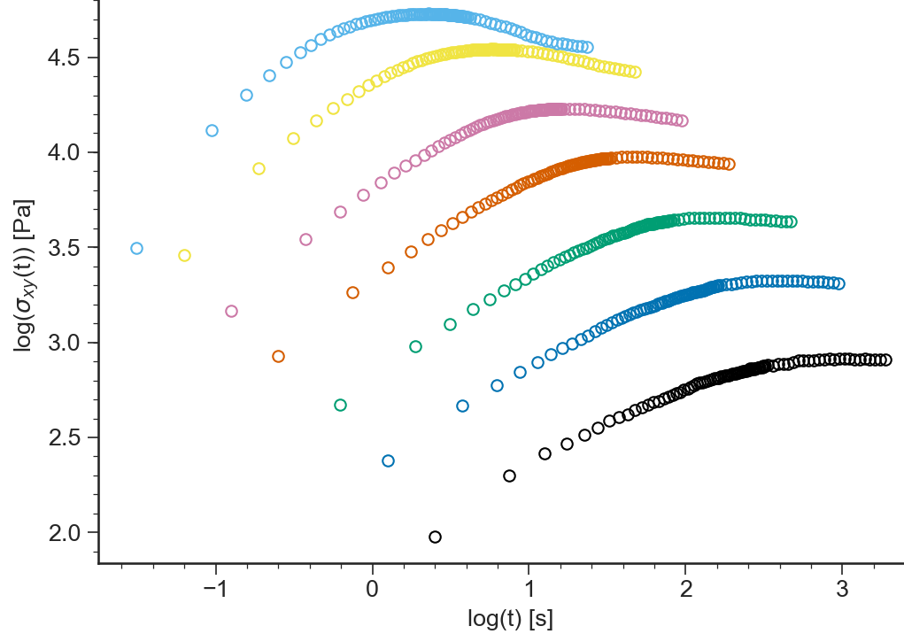
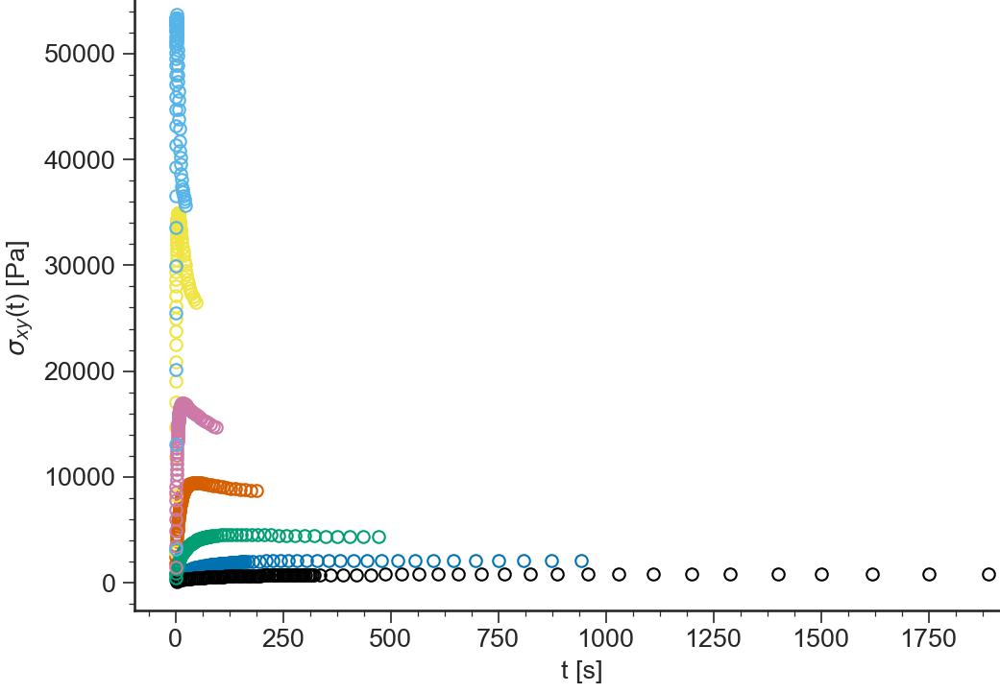

=========================
NLVE: General description
=========================

.. contents:: Contents
    :local:

..	toctree::
   	:maxdepth: 2
	
-------
Purpose
-------

.. autoclass:: RepTate.applications.ApplicationNLVE.ApplicationNLVE()	

----------
Data Files
----------

.. include:: ../datafile_doc.rst

``.shear`` extension
--------------------

Text files with ``.shear`` extension should be organised as follows:

- ``.shear`` files should provide parameter values for

  #. shear rate, :math:`\dot\gamma`
  #. temperature, :math:`T`

- 2 columns separated by **spaces** or **tabs** containing respectively:

  #. time, :math:`t`,
  #. shear stress growth function, :math:`\sigma^+(t)`,

A correct ``.shear`` file looks like:

.. code-block:: none
  
  gdot=0.1;T=160;
  2.50E-01 845
  7.50E-01 1830
  1.25E+00 2490
  ...      ...

``.uext`` extension
-------------------

Text files with ``.uext`` extension should be organised as follows:

- ``.uext`` files should provide parameter values for

  #. Hencky strain rate, :math:`\dot\varepsilon`
  #. temperature, :math:`T`

- 2 columns separated by **spaces** or **tabs** containing respectively:

  #. time, :math:`t`,
  #. tensile stress growth function, :math:`\sigma_E^+(t)`,

A correct ``.uext`` file looks like:

.. code-block:: none
  
  gdot=0.1;T=160;
  2.50E-01 845
  7.50E-01 1830
  1.25E+00 2490
  ...      ...

.. warning::
  The first line of the ``.uext`` file provides the flow rate as ``gdot=0.1``, **not** ``edot=0.1``

-----
Views
-----

log(eta(t))
---------------------
.. automethod:: RepTate.applications.ApplicationNLVE.BaseApplicationNLVE.viewLogeta()

.. image:: images/NLVE_logeta.png
    :width: 45%
    :align: center

eta(t)
---------------------
.. automethod:: RepTate.applications.ApplicationNLVE.BaseApplicationNLVE.vieweta()

.. image:: images/NLVE_eta.png
    :width: 45%
    :align: center

log(sigma(gamma))
---------------------
.. automethod:: RepTate.applications.ApplicationNLVE.BaseApplicationNLVE.viewLogSigmaGamma()

    
sigma(gamma)
---------------------
.. automethod:: RepTate.applications.ApplicationNLVE.BaseApplicationNLVE.viewSigmaGamma()

.. image:: images/NLVE_sigmagamma.png
    :width: 45%
    :align: center

log(sigma(t))
---------------------
.. automethod:: RepTate.applications.ApplicationNLVE.BaseApplicationNLVE.viewLogSigmaTime()

    
sigma(t)
---------------------
.. automethod:: RepTate.applications.ApplicationNLVE.BaseApplicationNLVE.viewSigmaTime()

