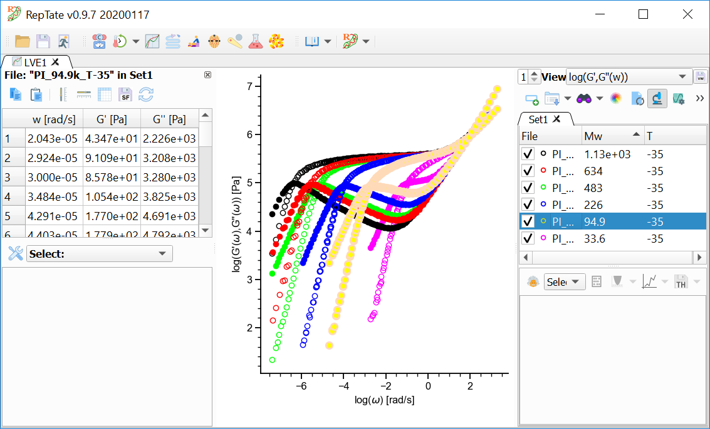

-----------------------
Inspecting the Data 
-----------------------

.. |inspectiondata| image:: /gui_icons/icons8-microscope.png
    :width: 15pt
    :height: 15pt
    :align: bottom

.. |shiftvertical| image:: /gui_icons/icons8-vertical-timeline-slider.png
    :width: 15pt
    :height: 15pt
    :align: bottom

.. |shifthorizontal| image:: /gui_icons/icons8-timeline-slider.png
    :width: 15pt
    :height: 15pt
    :align: bottom

When the user clicks the button "Inspect contents of data files" |inspectiondata| (Ctrl+I) in the Dataset area, a new panel is shown on the left side of the application window. In this panel, some operations can be done on the data, like checking the contents, copy and pasting data, shifting the curves around by dragging them with the mouse or applying Tools to the data.

View the current file data
--------------------------

When a file in the current Dataset is selected with the mouse, the corresponding plot is highlighted and the contents of the file are shown in the data inspection table (if the data inspection table is shown, see :numref:`figdatainspection`). 

.. _figdatainspection:

    	
    Inspecting the contents of the selected file.

Copy/Paste data
---------------

The data shown in the inspection data table can be copied as text (columns separated by tabs) by selecting the corresponding cells, columns or rows from the table and pressing the button "Copy" in the data inspaction area. The copied data can be pasted in another application like Excel or Matlab, or even to a different file by pressing the button "Paste" in the data inspection area.

Shift the data
--------------

Sometimes it may be convenient to compare features of two different data files that are represented in the same plot. For example, one may be interested in comparing the different terminal regions of G' data of samples of the same polymer with different molecular weight. RepTate allows the user to shift the data vertically and/or horizontally by pressing the buttons "Shift the selected curve vertically" |shiftvertical| and/or "Shift the selected curve horizontally" |shifthorizontal|, respectively, in the data inspection area. Once the user finishes shifting the curves, he/she can check, save and reset the values of the shift factors by clicking on the corresponding buttons in the data inspection area. The whole procedure is summarized in :numref:`figshiftfiles`.

.. _figshiftfiles:
.. figure:: images/shiftingfiles.gif
    :width: 75%
    :align: center
    	
    Shifting some curves horizontally and viewing the shift factors.

When the axis with respect to which the shifting is being carried out is in logarithmic scale, the shift factor represents the decimal logarithm of the factor by which one should multiply the data in order to obtain the observed shift. When the axis is in linear scale, the shift factor is just the linear shift needed to obtain the observed shift.
