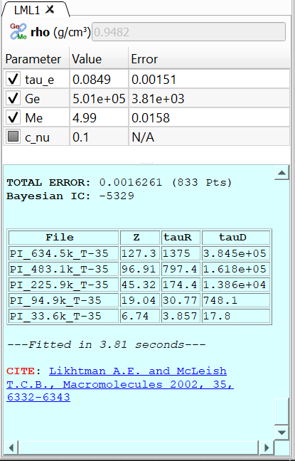
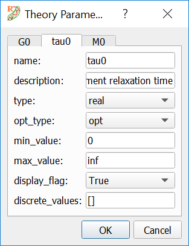
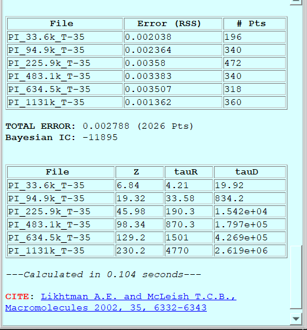

-----------------------
Fitting a theory 
-----------------------

.. |newtheory| image:: /gui_icons/icons8-einstein.png
    :width: 15pt
    :height: 15pt
    :align: bottom

.. |calculatetheory| image:: /gui_icons/icons8-abacus.png
    :width: 15pt
    :height: 15pt
    :align: bottom

One of the most important features of RepTate is the ability to easily fit a theory to a set of experimental data files. The available theories in each RepTate application are described and discussed in the documentation corresponding to each application. Here, we give a short summary of the general ideas about how theories are handled in RepTate. 

It is important to note that, in RepTate, theories *belong* to Datasets, *i.e.* they are applied only to the data files in the Dataset under which the theory was created. 

Opening a new Theory
--------------------

Below the Dataset table that contains the files, there is a toolbar for operating with theories. First, the user should select a theory from the list available in the drop-down menu. Once the right theory is selected, a new instance of the theory can be created by clicking on the "Create Selected Theory" button |newtheory| (Alt+N). New theories are shown as tabs below the theory toolbar. By default, theories are named after a combination of capital letters selected after the theory name + an index number. The name of any theory can be changed by double clicking on the corresponding tab.

Viewing/Editing Parameter values and options
--------------------------------------------

When a new theory instance is created, a new tab opens in which two clearly separate areas can be seen (see :numref:`figtheoryarea`):

- A table that lists the parameters of the theory, with their current value and, if the theory has been fitted to some experimental data, the error of the fitting. 
- A text area with a light blue background that shows all the relevant information during the calculation and fitting of the theory, as well as any citation information that is relevant to the current theory.

.. _figtheoryarea:

    	
    A theory with the parameters table and the log area (with cyan background).

Theory parameters can be shown in the table in three possible states:

    - Checked: the parameter value will be optimized during the fitting procedure.
	- Unchecked: the value of the parameter will not be optimized (it will remain constant during the next fitting procedure).
	- Grayed out or partially checked: the parameter cannot be optimized. This is intended for parameters, like exponents of scaling factors, that take well known values. Typically, *grayed* parameters take their value from a set of prescribed discrete values. 

Theory parameters have properties, and some of these properties are very important during theory fitting. In order to check and edit the properties of parameters, the user can double-click on any parameter name. Then, a dialog is shown with a tablist, with a tab for each parameter of the theory and the current properties of each parameter (see :numref:`figparameterproperties`). The most important properties of a parameter are:

- **name**: the short name of the parameter. It is hardcoded into the theory and cannot be changed.
- **description**: a short description of the parameter. It is hardcoded into the theory and cannot be changed.
- **type**: the numerical type of the value of the parameter. It can be *real*, *integer*, *discrete_real* (its value is selected from a discrete list of real values), *discrete_integer* (discrete list of integer values) and *boolean*. 
- **opt_type**: indicates whether the parameter value will be optimized during the fitting procedure or not. Possible states are: *opt* (will be optimized), *nopt* (will not be optimized) and *const* (cannot be optimized).
- **min_value**: minimum value that the parameter can adopt. If the parameter is not bounded, the minimum value is *-inf*.
- **max_value**: maximum value that the parameter can adopt. If the parameter is not bounded, the maximum value is *inf*. The bounds should not be exceeded during minimization. If the user inputs manually a value that is outside the bounds, RepTate will issue a warning and set the parameter value to the bound that has been exceeded.
- **display_flag**: whether the parameter will be shown in the parameter table or not.
- **discrete_values**: comma-separated list of values that the parameter can adopt. Only relevant if the parameter type is either *discrete_real* or *discrete_integer*.
- **quantity**, **internal_unit** and **display_unit**: unit metadata for unit-aware parameters. The parameter value used by the theory is stored in ``internal_unit``. The value shown in the table is converted to ``display_unit``. If compatible units are registered, ``display_unit`` can be changed from the parameter-properties dialog without changing the stored physical value.

For unit-aware parameters, editing the value in the theory table uses the
display unit shown next to the parameter name. For example, a parameter stored
internally in ``kg/mol`` may be displayed and edited in ``Da``; RepTate converts
the entered value back to ``kg/mol`` before the calculation.

.. _figparameterproperties:

    	
    Dialog for viewing/editing parameter properties.

Calculating the theory
----------------------

When the button "Calculate Theory" |calculatetheory| (Alt+C) is pressed, the theory is calculated using the current values of the theory parameters and for all the files in the current dataset. Since the theory may use some of the file parameters, the result of applyting the theory to each files will be different. By default, the theory is calculated exactly in the same *x* points as the corresponding data file. This can be changed by editing the file parameters and selecting "Extra Theory Range". 

When the theory calculation is done, some interesting information is shown in the theory log area (see :numref:`figtheorycalclog`). By default, the information displayed contains:

- A table with the list of files that theory has been applied to, with the selected error measure and the number of points of each file.
- The total error (the weighted mean of the file errors) and the total number of points.
- The Bayesian Information Criterion (BIC), always evaluated from the non-normalized mean squared error as :math:`BIC = n \log(MSE)+ p\log(n)`, where *n* is the number of data points and *p* is the number of free fitting parameters. In general, the model with the lowest BIC value should be preferred.
- Some additional information may be shown by some theories (for example, in :numref:`figtheorycalclog`, the Likhtman-McLeish theory shows some tube related values for each file). 
- The time it took to calculate the theory, in seconds. 
- The relevant literature that the user should cite if he/she intends to use the results from the theory. The journal articles are shown as links that can be clicked in order to visit the publisher web.

Error calculation options
-------------------------

The error calculation options are available from the Calculate Theory button menu. The checkbox **Normalize by experimental data** controls whether residuals are divided by the experimental data before the error is computed. The **Error norm** option controls whether squared residuals or absolute residuals are averaged. The four combinations are reported in the theory log using the following labels:

- **MSE**: :math:`\mathrm{mean}((y_\mathrm{th} - y_\mathrm{exp})^2)`
- **MSRE**: :math:`\mathrm{mean}(((y_\mathrm{th} - y_\mathrm{exp}) / y_\mathrm{exp})^2)`
- **MAE**: :math:`\mathrm{mean}(|y_\mathrm{th} - y_\mathrm{exp}|)`
- **MRAE**: :math:`\mathrm{mean}(|(y_\mathrm{th} - y_\mathrm{exp}) / y_\mathrm{exp}|)`

The default is the historical squared, non-normalized error (**MSE**).

.. _figtheorycalclog:

    	
    Example of the information displayed after a theory calculation is finished.

Fitting the theory
------------------

Use the ``Minimize Error`` button in the theory toolbar, or press ``Alt+M``,
to fit the currently active theory tab to the active files in the current
dataset. Fitting changes only the parameters that are checked in the theory
parameter table; unchecked parameters keep their current values, and grayed
parameters cannot be optimized.

The fit uses the data as shown in the current view. Hidden files are ignored.
For theories that can only use one file, RepTate warns if more than one file is
active and then uses the highlighted file, or the first active file if no file
is highlighted.

When fitting starts, RepTate writes a ``Parameter Fitting`` section in the
theory log. If graphical x- or y-range limits are visible, the selected ranges
are reported there and only points inside those ranges are used. Points with
``NaN`` or infinite values are excluded from the fit.

During a fit, the ``Minimize Error`` button changes to a stop button. Pressing
it again requests the current fit to stop. If a theory calculation is already
running, RepTate does not start a fit and reports that the theory is busy
calculating.

After a successful fit, the optimized parameter values are stored in the active
theory, the parameter table is updated, and the theory is recalculated with the
fitted parameters. The log reports the initial and final error, the number of
function evaluations, the fitted parameter values with estimated errors when
available, the elapsed fitting time, and any citation information supplied by
the theory.

How the fitting is done
-----------------------

During fitting, RepTate minimizes the selected error between the active theory
prediction and the selected experimental data. The experimental data are first
converted through the current application view, so fitting is performed on the
same coordinates that are displayed in the plot. Only active files are used.
If x- or y-range fitting limits are visible, only points inside those ranges
are included. Points with ``NaN`` or infinite x or y values are ignored.

The optimizer changes only the theory parameters that are checked in the
parameter table. Unchecked parameters keep their current values, and grayed
parameters cannot be selected for fitting. The starting values are the current
parameter values. The minimum and maximum values in the parameter properties
are passed to the fitting method as bounds, and integer parameters are marked
as integer-valued where the selected method supports this.

For each trial set of parameter values, RepTate recalculates the theory and
compares the resulting prediction with the selected experimental points. The
error measure is the one selected in the error-calculation options: squared or
absolute residuals, with optional normalization by the experimental data. If
normalization by experimental data is selected and the fitting data contain
zero values, the fit is stopped because the relative error cannot be evaluated.

The default ``LS`` method is a local fit starting from the current parameter
values. The global fitting methods first search more broadly over the allowed
parameter bounds, then RepTate refines the result with a local fitting step
before storing the final parameters. A fit can still depend on the chosen
starting values, parameter bounds, data range, error measure, and fitting
method; RepTate does not guarantee that a global optimum has been found.
Individual theories may also extend or override parts of the generic
calculation.

When fitting finishes successfully, the active theory parameters are updated,
the theory is recalculated with the fitted values, and the plot is refreshed.
The theory log reports the fitting method, any active fitting ranges, progress
messages from the selected method, the initial and final error, the number of
function evaluations, fitted parameter values with estimated errors when
available, the elapsed fitting time, and theory citation information.

Setting x and y-range limits to the fitting graphically
-------------------------------------------------------

Use the ``Show Limits`` toolbar button menu to restrict the data points used
when fitting the active theory. The ``xrange`` action shows or hides vertical
limit lines and a yellow x-range span. The ``yrange`` action shows or hides
horizontal limit lines and a pink y-range span. When a limit selector is first
shown, RepTate initializes it from the current plot limits.

The limit lines can be dragged on the plot. During fitting, RepTate uses only
the points from active files whose current-view coordinates are inside the
visible ranges. If both ranges are visible, a point must satisfy both the
x-range and y-range tests. The selected ranges are written to the theory log at
the start of the fit.

These limits are view-based fitting limits. They are applied after the
application view has transformed the file data, so the numbers correspond to the
axes currently shown in the plot rather than necessarily to raw file columns.
The limits belong to the active theory tab.

Hiding a range selector disables that range filter for fitting. The original
data remain displayed, and excluded points are not deleted from the dataset.
After the fit, RepTate recalculates the theory with the fitted parameters; the
prediction table is not limited to only the selected fitting interval.

Fitting options
---------------

The ``Minimize Error`` button has a menu entry called ``Fitting Options``.
It opens the fitting-options dialog for the active theory tab. The selected
tab in this dialog chooses the minimization method used the next time
``Minimize Error`` is pressed, and the fields on that tab set the numerical
options passed to that method.

The default tab is ``LS`` (least squares). It is a local optimization method
and uses the current values of the checked theory parameters as the starting
point. For squared-error fits, the ``LS`` tab lets the user choose the
``trf``, ``dogbox``, or ``lm`` SciPy method, set the ``ftol``, ``xtol``, and
``gtol`` stopping tolerances when their check boxes are enabled, choose the
loss function and ``f_scale`` used by the trust-region methods, and optionally
limit the maximum number of function evaluations. If the absolute-error
measure is selected in the error-calculation options, RepTate minimizes that
selected error with an ``L-BFGS-B`` local minimizer instead of using the
least-squares residual solver.

The other tabs select global search methods: ``Basin Hopping``,
``Annealing``, ``Evolution``, ``SHGO``, and ``Brute``. These options are useful
when the initial parameter values may be far from the best solution or when the
error surface may contain several local minima. They can require many more
theory evaluations than the default least-squares fit. After a global search,
RepTate refines the result with the local least-squares fitting step before
reporting the final fitted parameters.

Global methods use the minimum and maximum bounds defined in the theory
parameter properties. ``Annealing``, ``Evolution``, and ``SHGO`` require finite
parameter bounds; if any optimized parameter has an infinite or undefined bound,
RepTate stops the fit and reports that the selected method cannot be used.
Several global-method tabs include an optional random-number seed. Enabling and
setting the seed makes the stochastic part of that search reproducible.

Saving theory predictions
-------------------------

Use the ``Save Theory Data`` button in the theory toolbar to write the
predictions of the current theory to text files. This is useful when the fitted
or calculated theory curves should be reused outside RepTate, compared in
another program, or archived with the data analysis.

RepTate first asks for the folder where the files should be written. It then
offers an optional text label that is appended to each output filename. For a
data file named ``sample.tts``, the saved prediction file is named
``sample_TH.tts`` by default, or ``sample_TH_<label>.tts`` if a label is entered.

One prediction file is written for each file in the current dataset. Each file
contains the original file parameters, a comment identifying the theory, the
current theory parameter values, the date and user, the original file column
names, and the numerical values stored in the theory prediction table.

The saved values are the theory predictions currently stored for the theory.
If the theory parameters or calculation range have changed, calculate the theory
again before saving so that the written files match the displayed prediction.

Copying/Pasting theory parameters
---------------------------------

Use the ``Copy Parameters`` and ``Paste Parameters`` actions in the theory
toolbar menu to transfer parameter values through the system clipboard. These
actions operate on the currently active theory tab and are useful for reusing a
set of parameters in another theory instance of the same type, or for storing a
parameter set temporarily in an external text editor.

``Copy Parameters`` writes one parameter per line, using the parameter name and
its current stored value separated by a tab. ``Paste Parameters`` reads the
clipboard line by line and updates only the parameters whose names match
parameters in the active theory. Lines that do not contain exactly two entries,
or whose parameter name is not present in the active theory, are ignored.

Pasted values are checked with the same parameter rules used by the theory:
real and integer values must be valid numbers, bounded parameters are clipped
to their allowed range, and discrete parameters must match one of their allowed
values. Boolean parameters accept common true values such as ``True`` or ``1``;
other values are interpreted as false.

The clipboard format uses the theory's stored parameter values. For
unit-aware parameters this means the internal value is copied and pasted, not
the display-unit value shown in the parameter table. If the active theory is set
to auto-calculate, RepTate recalculates the theory after the paste operation.

Showing all theories applied to current DataSet
-----------------------------------------------

Use ``View All Theories (Same DataSet)`` from the ``View All Sets`` toolbar
button menu to display the predictions from all theory tabs in the current
dataset at the same time. This is useful when several theories have been
calculated for the same files and their curves need to be compared directly on
the plot.

The action does not create, calculate, or fit any theory. It only changes the
visibility of the theory curves that already exist for the current dataset.
Each theory is shown using the prediction tables currently stored in its theory
tab, so calculate or fit each theory first if its displayed prediction is out of
date.

The command applies only to theories that belong to the active dataset tab.
It does not show theories from other datasets. Files that have been hidden in
the dataset remain hidden, together with their corresponding theory curves.

After using this command, selecting a different theory tab returns to the usual
single-active-theory display: RepTate hides the other theory curves and shows
the curves associated with the selected tab.
