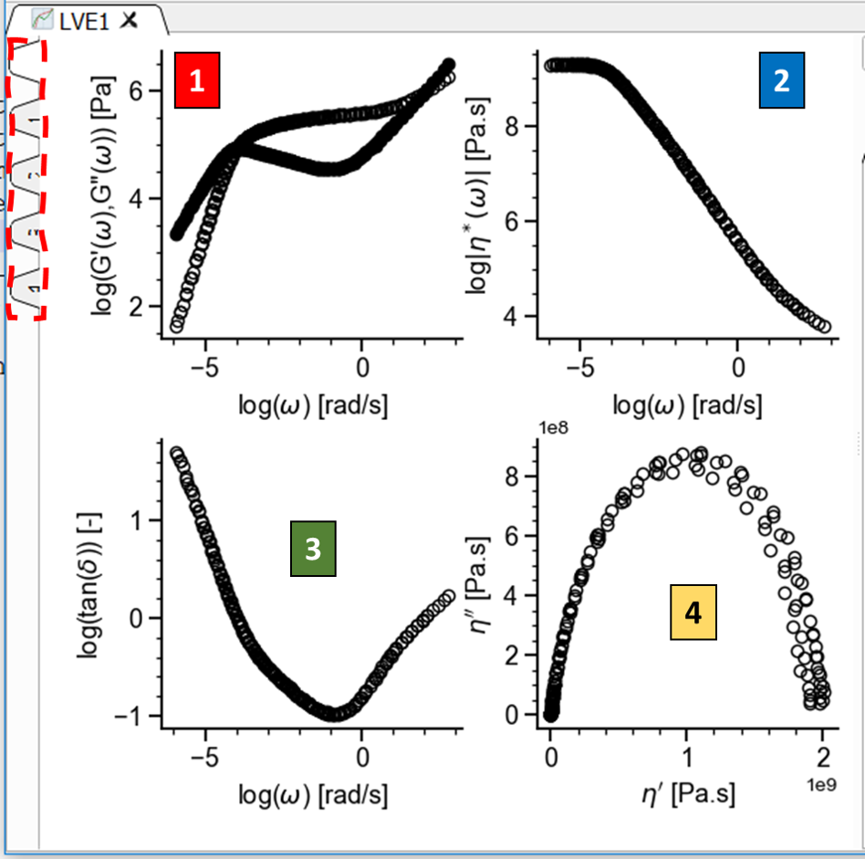
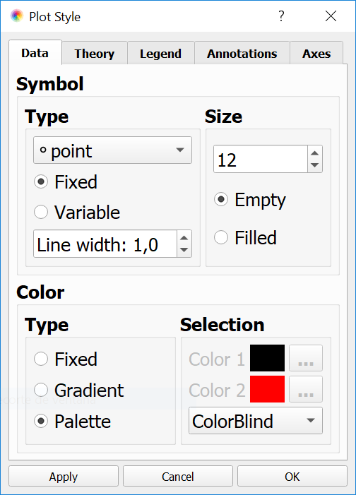
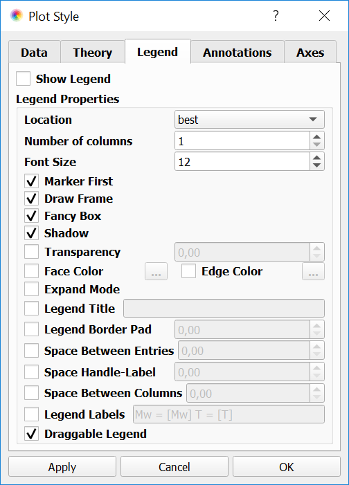

-----------------------
Operating with Views 
-----------------------

.. |saveview| image:: /gui_icons/icons8-saveView.png
    :width: 20pt
    :height: 20pt
    :align: bottom

.. |viewall| image:: /gui_icons/icons8-binoculars.png
    :width: 20pt
    :height: 20pt
    :align: bottom

.. |figuretoolbar| image:: /gui_icons/icons8-sine-100.png
    :width: 20pt
    :height: 20pt
    :align: bottom

.. |plotsettings| image:: /gui_icons/icons8-color-wheel-2.png
    :width: 20pt
    :height: 20pt
    :align: bottom

The data read from the files can be represented in several different ways, which are different for each application. In RepTate, the way some experimental or theory data are represented is referred to as the **View**. 

There are two different ways to select a View:

- From the drop-down box at the top-right corner of the Application window. By clicking on the box, a menu is shown with all the Views that are defined in the current application. By hovering the mouse over the View names, some additional information may be displayed. 
- By right-clicking on the plot area, a menu is displayed. By selecting the submenu "Select View", the user can select the view from a list (the contents of the list are exactly the same as in the drop-down box). 

At the left of the drop-down box, there is a small up-down selector that allows the user to change the number of graphs that are shown in the plot area. When there are more than one graph, a small set of tabs is shown on the left of the Plot area (see :numref:`figmanyviews`). The number of tabs is equal to the number of Views + 1. The tab 0 shows all views and the other tabs show a single view.

.. _figmanyviews:

    	
    Plot area showing 4 different views and the tabs to switch from all to particular views (left).

Most Applications in RepTate show just one graph by default. 

The data, as represented by the current View/Views, can be saved to a text file by clicking on the button |saveview| at the right of the View combo box.

Plot Area 
-----------------------

The plot area shows the graphical representation of the data files in the current Dataset (or all the Datasets in the current application, if the "View all Datasets simultaneously" button |viewall| is clicked). Several operations can be done in the plot area:

- By clicking on a data point, a label is shown with  its (:math:`x`, :math:`y`) coordinates, with respect to the current View (label **1** in :numref:`figplotarea`). The label can be hidden by clicking on it again.
- By right-clicking on the plot area and dragging the mouse, the user can zoom to an specific region of the plot.
- By using the mouse wheel, the user can zoom in or out in the plot. 
- By right-clicking on the plot, a menu is shown with the following operations (label **3** in :numref:`figplotarea`):
    - The chart can be copied to the clipboard as an image. The image can be pasted on any other program (such as Microsoft Word or Powerpoint)
    - The chart can be saved to an image file, using different formats (png, pdf, etc).
    - An annotation label can be added to the plot (label **2** in :numref:`figplotarea`). LaTeX commands can be used in the text of the annotation. Annotation labels can be moved around by dragging them with the mouse and edited by double-clicking on them.
    - The view can be reset to the default zoom.
    - The view can be changed to any of the available views in the current application.
	
.. _figplotarea:
.. figure:: images/Plot_Area.png
    :width: 50%
    :align: center
    	
    Plot area showing data point coordinates (1), annotations (2) and pop-up menu (3).

Additional view options can be set by clicking on the "Show/Hide Figure Toolbar" button |figuretoolbar| on the Dataset area. The x-y ranges can be fixed by clicking on the "Lock XY axes" in the Dataset area.

Changing the Plot Properties
----------------------------

Most of the visual aspects of the plot (lines, symbols, axes labels, legend, etc) can be changed, by clicking the "Plot Settings" button |plotsettings| (Ctrl+M) in the Dataset area. A dialog is shown with different tabs, each one dedicated to a different aspect of the plot. 

- **Data**: in this tab, the user can select how the experimental data loaded in the Dataset is shown on the current view (see :numref:`figplotstyledata`). By default, the experimental data is always shown as symbols, and the user can select the symbol type, size and colour. The different files in the Dataset can be shown with the same or different symbols and the colour can be set by selecting from a list of available colour palettes. Alternatively, the color can be fixed for all files or selected from a gradient, interpolating from Colour1 (which is used for the first file in the current Dataset) to Colour2 (for the last file). 

.. _figplotstyledata:

    	
    Changing the Plot properties of the data.

- **Theory**: the line type, width and colour can be selected (fixed or the same colour as the data). 

- **Legend**: here, the user can select if he/she wants to show the legend in the current plot, along with its location, font and other properties 
such as the label that will be used to represent the data (see :numref:`figplotstylelegend`). For example, if the files in the current Dataset have 
the parameter *Mw* defined with a value, it can be used as the legend label by filling the *Legend Labels* field with the text "Mw = [Mw]".

- **Annotations**: here, the default properties of annotations (colour, font, opacity, etc) can be set. All new notations will have these properties. Individual annotation properties can be changed by double-clicking on the text of a particular annotation.

.. _figplotstylelegend:

    	
    Changing the style of the legend.

- **Axes**: the font of the labels and the colour of the labels and axes can be changed. Also, the user can choose whether to show grid lines or not. 

As an example, a plot of LVE data with different graphical settings is shown in :numref:`figplotstylelegend`.

.. _figplotstylechanged:
.. figure:: images/PlotStyleChanged.png
    :width: 60%
    :align: center
    	
    Example of a plot of LVE data where some of the default graphical properties have been changed. 

